# Kawaii Life: Site Owner's Guide 🎀

Welcome! This guide shows you how to run the **Kawaii Life** shop day to day: changing the header and home page, adding products, handling orders, editing pages and checking reports.

You don't need any technical knowledge. Every task is a short list of steps with a real screenshot from your site.

> **How to read this guide**
>
> - **Bold words** are buttons, menu items or field names you click or type into.
> - An arrow such as **Kawaii Life → Theme Options** means "click **Kawaii Life** in the left menu, then **Theme Options** under it".
> - 💡 marks a tip. ⚠️ marks something to be careful with.

---

## Contents

1. [Logging in and finding your way around](#1-logging-in-and-finding-your-way-around)
2. [Theme Options: the shop's main settings](#2-theme-options-the-shops-main-settings)
3. [The header menu](#3-the-header-menu)
4. [The footer and newsletter band](#4-the-footer-and-newsletter-band)
5. [Editing pages (the basics)](#5-editing-pages-the-basics)
6. [The home page](#6-the-home-page)
7. [Products](#7-products)
8. [Categories, Friends and attributes](#8-categories-friends-and-attributes)
9. [Coupons and "Offers for you"](#9-coupons-and-offers-for-you)
10. [Orders](#10-orders)
11. [Invoices, packing slips and labels](#11-invoices-packing-slips-and-labels)
12. [Delivery zones, charges and dates](#12-delivery-zones-charges-and-dates)
13. [Customers, sign-up and saved addresses](#13-customers-sign-up-and-saved-addresses)
14. [What customers see: cart, checkout and My Account](#14-what-customers-see-cart-checkout-and-my-account)
15. [Wishlists, searches and carts (activity logs)](#15-wishlists-searches-and-carts-activity-logs)
16. [Videos and the Kawaii World page](#16-videos-and-the-kawaii-world-page)
17. [The blog](#17-the-blog)
18. [Information pages](#18-information-pages)
19. [Forms and messages](#19-forms-and-messages)
20. [SMS, email and newsletter](#20-sms-email-and-newsletter)
21. [SEO (Google and social sharing)](#21-seo-google-and-social-sharing)
22. [Reports](#22-reports)
23. [Backups](#23-backups)
24. [Not live yet](#24-not-live-yet)
25. [Quick answers](#25-quick-answers)

---

## 1. Logging in and finding your way around

1. Go to **yourdomain.com/wp-admin** (for example `https://kawaiilife.com/wp-admin`).
2. Type your username and password and click **Log In**.

You land on the **Dashboard**. The menu on the left lists everything you can manage.

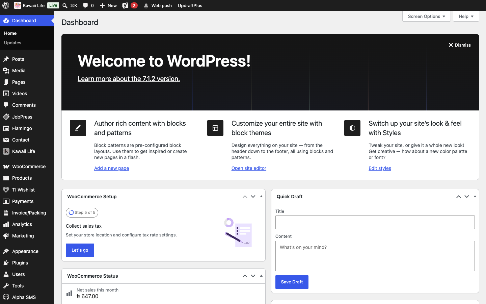

**The menu items you'll use most:**

| Menu item | What it's for |
| --- | --- |
| **Pages** | The site's pages: Home, About Us, FAQ, Delivery Information and so on |
| **Posts** | Blog articles (Kawaii World articles) |
| **Videos** | Brand videos shown on the Kawaii World page |
| **Kawaii Life** | Theme Options, plus the Wishlist, Search and Cart logs |
| **WooCommerce → Orders** | Customer orders |
| **Products** | Products, categories, Friends (characters) and reviews |
| **Marketing → Coupons** | Discount codes |
| **Invoice/Packing** | Invoices, packing slips and shipping labels |
| **Label Printing** | Barcode labels for products and orders |
| **Appearance → Menus** | The links in the header |
| **Contact** and **Flamingo** | Forms (returns, wholesale) and the messages people send |
| **Analytics** and **Ninjalytics** | Sales reports |

💡 To see the shop as a customer does, hover over **Kawaii Life** at the top-left of the black bar and click **Visit Site**.

---

## 2. Theme Options: the shop's main settings

**Where:** **Kawaii Life → Theme Options**

Theme Options holds the shop-wide settings that were built for Kawaii Life. The sections are listed on the left. Click one to open it, change what you need, then click the pink **Save Changes** button (top-right or at the bottom).

### 2.1 Header: announcement bar, logo and icons

**Announcement bar**: the pink strip at the very top of every page.

- **Show the bar**: the switch next to the title turns the whole strip on or off.
- **Slides**: each slide is one message, such as "Free Delivery on orders over ৳999".
  - **Icon**: choose *Emoji or text* and paste an emoji, choose a *Built-in icon*, or upload an *Image*.
  - **Text**: the message.
  - **Link** (optional): where the message goes when clicked, for example `/delivery-information/`.
  - Use the **↑ ↓** arrows to reorder slides and **×** to delete one. Click **+ Add slide** to add another.
- **Autoplay interval**: how long each message stays, in milliseconds (4000 = 4 seconds).
- **Pause while hovered**: stops the messages moving while a visitor's mouse is over them.

**Logo**

- **Header logo image**: click **Choose image** to pick a new logo from the Media Library. **Remove** goes back to the theme's logo.
- **Logo width**: the logo's width in pixels (68 by default).

**Navigation**: the menu links themselves are edited under **Appearance → Menus** (see [section 3](#3-the-header-menu)). The **Open Menus** button takes you there.

**Header icons**: switch the search, account, wishlist and cart icons on the right of the header on or off.

### 2.2 Shop page

- **Page heading**: the **Title** ("All Products"), the **Title emoji** (🎀) and the **Short description** under it. The emoji also shows on category pages. Leave the description empty to hide it.
- **Catalog → Products per page**: how many products each page of the shop shows.
- **Price ranges**: the price choices in the shop's filter sidebar. Each range has a **Min price** and a **Max price**. Leave Min empty for "Under …" or Max empty for "Over …"; the labels are written for you.
- **Product cards**: show or hide the **Sale badge**, the **Star rating** and a **Quick add to cart** button on each product card.

### 2.3 Product page

The **Shipping** and **Returns** text here appears under the Shipping and Returns tabs on **every** product page. Leave a box empty to hide that tab.

💡 One product can have its own text instead. See [Product page tab](#73-the-product-page-tab-taglines-video-shipping-and-returns-text).

### 2.4 Delivery

This section works out the **estimated delivery dates** customers see on product pages, on the order confirmation, in their emails and under My Account.

- **Working days per zone**: for each delivery zone, type the fewest and most working days an order takes (for example Inside Dhaka 1 – 2, Outside Dhaka 3 – 5). The zones themselves come from **WooCommerce → Settings → Shipping** (see [section 12](#12-delivery-zones-charges-and-dates)).
- **Weekend days**: click the days you don't deliver (Friday is selected).
- **Same-day cut-off**: orders placed after this time count from the next working day.
- **Holidays**: click **+ Add holiday** for Eid and other closures. Give it a name and a **From** date; add a **To** date if it's longer than one day. Holiday days are skipped when the dates are worked out.
- **Product page**: shows or hides the "Expected delivery" line on product pages. **When the zone is unknown** decides what a visitor who hasn't given an address sees. **Label** is the text in front of the dates.

💡 Once an order is placed, its delivery dates are saved with it. Changing these settings later doesn't change dates you've already promised.

### 2.5 General

- **Support email**: the address the "Email us" buttons on the information pages use. If it's empty, those buttons are hidden.
- **Dummy email extension**: used for accounts made with a phone number only. Leave this as it is.

### 2.6 Sections that aren't connected yet

These sections are in Theme Options, but changing them doesn't change the site yet. Edit these things in the places listed instead:

| Section | Edit it here instead |
| --- | --- |
| **General → Tagline** | **Settings → General → Tagline** |
| **General → Social profiles** | The footer, in **Appearance → Editor** (see [section 4](#4-the-footer-and-newsletter-band)) |
| **Home page → Hero** | The **Hero Slider** block on the Home page (see [section 6.2](#62-the-hero-slider)) |
| **Home page → Friends** | **Products → Friends**, and the Friends block on the Home page |
| **Wishlist** | **TI Wishlist → General Settings** |
| **Newsletter** | **Brevo → Forms** (see [section 20](#20-sms-email-and-newsletter)) |

---

## 3. The header menu

**Where:** **Appearance → Menus**

The links in the header (New Arrivals, Shop, Characters, Gifts, Best Sellers, Kawaii World) come from the menu called **Main Menu**.

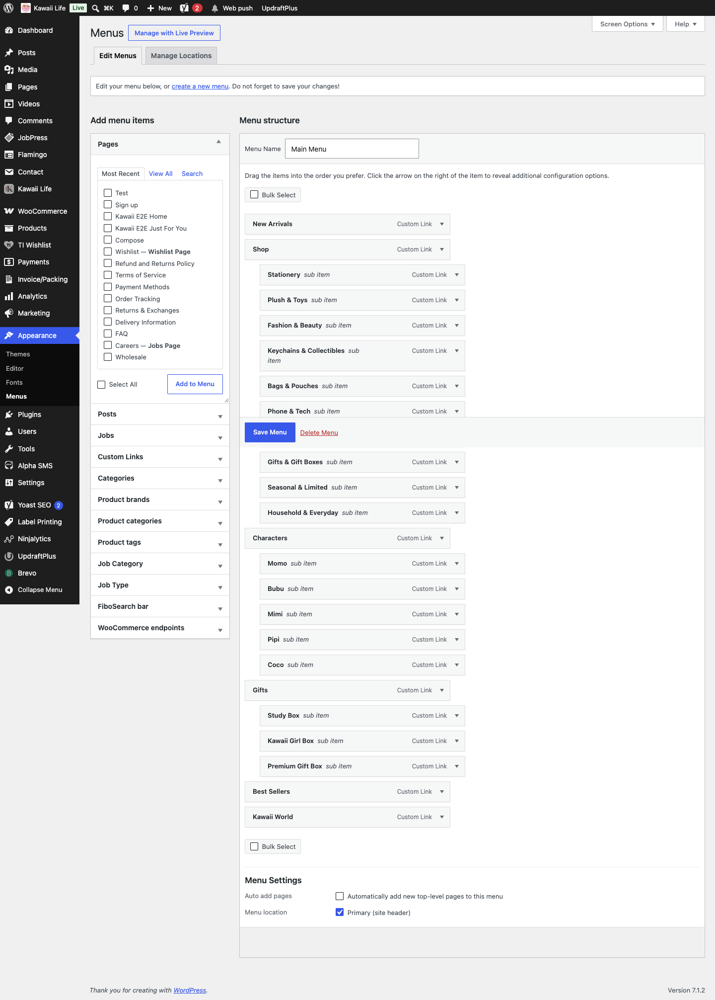

**To add a link:**

1. On the left, open **Pages**, **Product categories**, **Custom Links** or another box.
2. Tick what you want and click **Add to Menu**.
3. Drag the new item into place. Drag it slightly to the right, under another item, to make it a drop-down item.
4. Click **Save Menu**.

**To change or remove a link**, click the small arrow on the right of the item to open it:

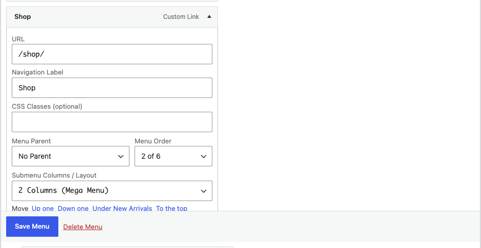

- **Navigation Label**: the text shown in the header.
- **Submenu Columns / Layout**: for an item with a drop-down, choose **1 Column (Standard)** or **2 Columns (Mega Menu)** for a wide two-column drop-down. This option was added for Kawaii Life.
- **Remove** (at the bottom of the item) deletes the link.

Then click **Save Menu**.

💡 The **Characters** links (Momo, Bubu, Mimi, Pipi, Coco) jump to the "Meet the Kawaii Life Friends" section of the home page. Keep their links as they are.

---

## 4. The footer and newsletter band

**Where:** **Appearance → Editor → Patterns → Template Parts → Footer**

The footer is the dark area at the bottom of every page. Above it is the pink **Join the Kawaii Club** newsletter band.

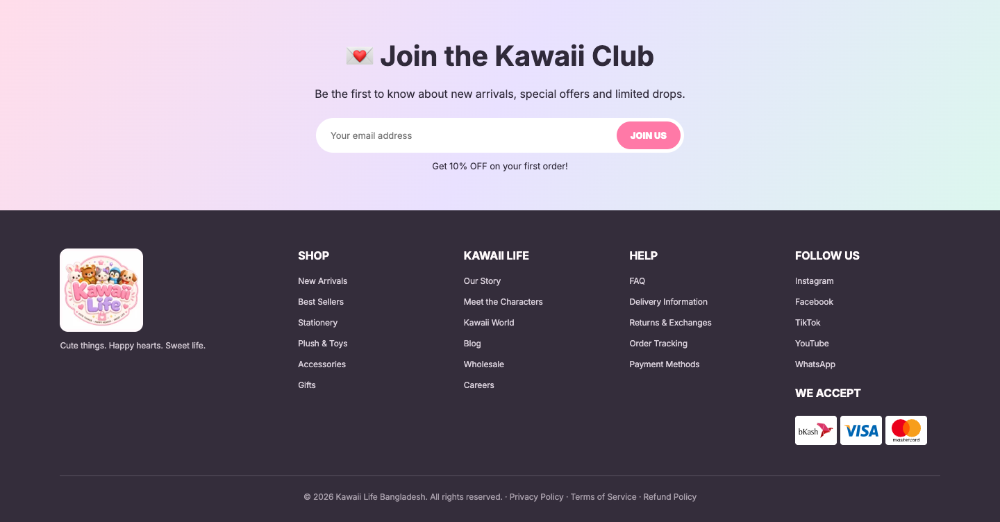

To edit them:

1. Go to **Appearance → Editor**.
2. Click **Patterns**, then **Footer** under *Template Parts*.
3. Click into any text or link to change it, just as you would on a page.

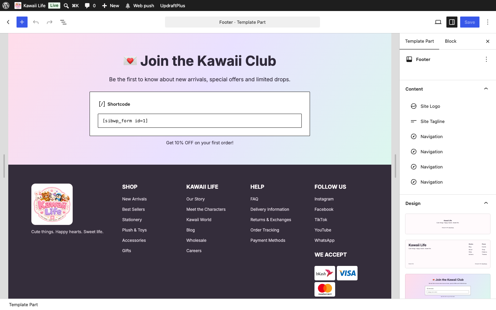

- **Footer links** (Shop, Kawaii Life, Help): click a link, then click the link icon in the small toolbar to change where it goes.
- **Follow Us** links (Instagram, Facebook, TikTok, YouTube, WhatsApp): click each one and paste your profile address. ⚠️ They point nowhere until you do this.
- **We Accept**: the payment logos are images; click one to replace or remove it.
- **The newsletter form** is the `[sibwp_form id=1]` box. Its fields and colours are edited in Brevo (see [section 20](#20-sms-email-and-newsletter)).
- Click **Save** (top-right) when you're done.

⚠️ After you save, your edited footer is used instead of the theme's original. To undo all your changes, click the three dots **⋮** next to *Footer* and choose **Reset**.

---

## 5. Editing pages (the basics)

**Where:** **Pages → All Pages**

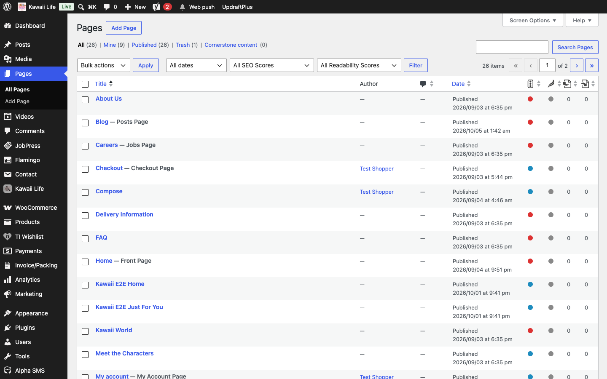

Hover over a page's name and click **Edit** to open it in the **block editor**. Each piece of the page (a heading, a paragraph, a banner, an FAQ question) is a **block**.

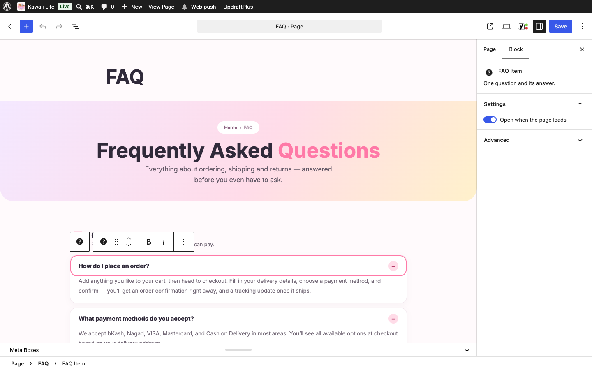

**Everything you need to know about the editor:**

- **To change text**, click on it and type.
- **To change a block's settings**, click the block. Its settings appear on the right under **Block**. If you can't see them, click the square **Settings** icon at the top-right.
- **To add a block**, click the blue **+** at the top-left and search for it (for example "FAQ Item" or "Paragraph"), or click **+** between two blocks.
- **To move a block**, click it and use the **↑ ↓** arrows in its small toolbar.
- **To delete a block**, click it, click the three dots **⋮** in its toolbar, then **Delete**.
- **To see the structure of the page**, click the **List View** icon (three lines) at the top-left.
- **To preview**, click the **View** icon at the top-right.
- **To save**, click **Save** at the top-right. Nothing changes on the live site until you do.

💡 Made a mistake? Press **Ctrl + Z** (Windows) or **⌘ + Z** (Mac) to undo. Every page also keeps a history: on the right, under **Page**, click **Revisions** to go back to an earlier version.

**Kawaii Life's own blocks.** The site has its own set of blocks, all starting with "Kawaii" or named after their job. You can add any of them from the **+** menu:

| Block | What it shows |
| --- | --- |
| **Page Banner** | The top banner of a page: breadcrumb, heading with a pink word, intro and buttons |
| **FAQ** / **FAQ Item** | Questions that open and close |
| **Icon Cards** / **Icon Card** | A row of cards with an emoji or icon, title and text |
| **Steps** / **Step** | Numbered steps joined by a dashed line |
| **Delivery Zones** / **Delivery Zone** | Delivery areas with time, charge and a free-delivery badge |
| **Eligibility** | Two cards: what's allowed (ticks) and what isn't (crosses) |
| **Pricing Tiers** / **Pricing Tier** | Wholesale price plans side by side |
| **Form Section** | A card around a contact form |
| **Help CTA** | "Need help?" band with buttons |
| **CTA Band** | A soft band with a heading, text and one button |
| **Policy** / **Policy Section** / **Policy Note** / **Policy Contact** | Policy pages with an "On this page" list |
| **Story Cover** / **Story Entry** / **Postcard** / **Sticker Sheet** | The diary-style About Us blocks |
| **Video Hero** / **Crew Grid** / **Reels** / **Kawaii Game** | The Kawaii World page's video sections |
| **Kawaii Life Hero Slider** | The home page's big slider |
| **Kawaii Life Benefits / USPs** | The row of shop promises under the hero |
| **Category tiles** | Product categories as icon tiles |
| **Kawaii Life Friends** | Every character as a card |
| **Kawaii World** | The "Step into the Kawaii World" card |
| **Just for You** | Products picked for each shopper |
| **Order Tracking** | The order lookup form |
| **Free Shipping Progress Bar** | How much more the shopper needs to spend for free delivery |

---

## 6. The home page

**Where:** **Pages → All Pages → Home → Edit**

The whole home page, top to bottom:

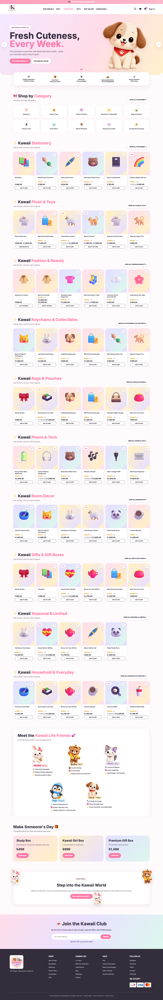

### 6.1 What's on it

| Section | Block | How to change it |
| --- | --- | --- |
| Big slider at the top | **Kawaii Life Hero Slider** | [6.2](#62-the-hero-slider) |
| The five promises under it | **Kawaii Life Benefits / USPs** | [6.3](#63-the-benefits-row) |
| Shop by Category | **Category tiles** | [6.4](#64-shop-by-category) |
| Product rows (Stationery, Plush & Toys …) | **Products by Category** | [6.5](#65-the-product-rows) |
| Meet the Kawaii Life Friends | **Kawaii Life Friends** | [Section 8.2](#82-friends-the-characters) |
| Make Someone's Day (gift boxes) | Groups of headings and buttons | Click and type |
| Step into the Kawaii World | **Kawaii World** | Click the text to edit it; the button and characters are in the block's settings |

### 6.2 The hero slider

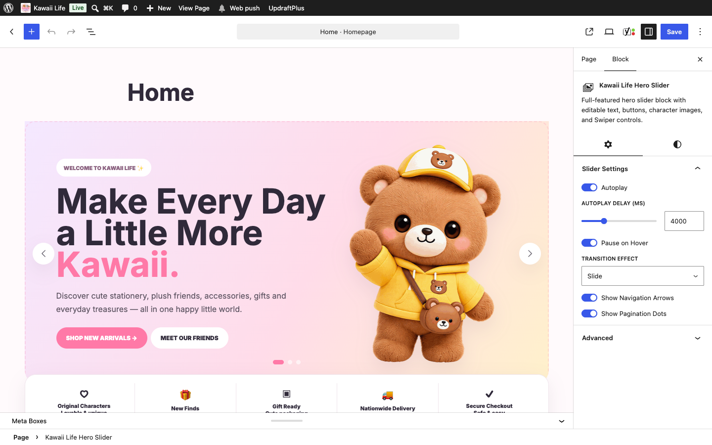

- **To change the words**, click the eyebrow ("Welcome to Kawaii Life"), the title, the pink accent word, the description or a button, and type.
- **To change the character picture**, click the picture and pick a new one from the Media Library. 💡 Use a PNG with a transparent background, like the bear.
- **To change a button's link**, click the slide, then on the right under **Slide Settings** fill in **Primary Button URL** or **Secondary Button URL**.
- **Each slide is its own block.** Open **List View** to see the three slides. To add one, select a slide, click **⋮** and **Duplicate**, then edit the copy.
- **Slider Settings** (click the slider itself): **Autoplay** and **Autoplay Delay**, **Pause on Hover**, **Transition Effect** (Slide or Fade), and whether to show the arrows and dots.

### 6.3 The benefits row

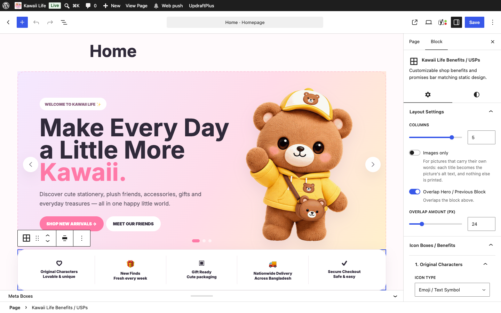

Click the block. Each promise has an **Icon Type** (emoji, text symbol or image), a **Title** and a **Short Description**. **Columns** sets how many sit in a row.

### 6.4 Shop by Category

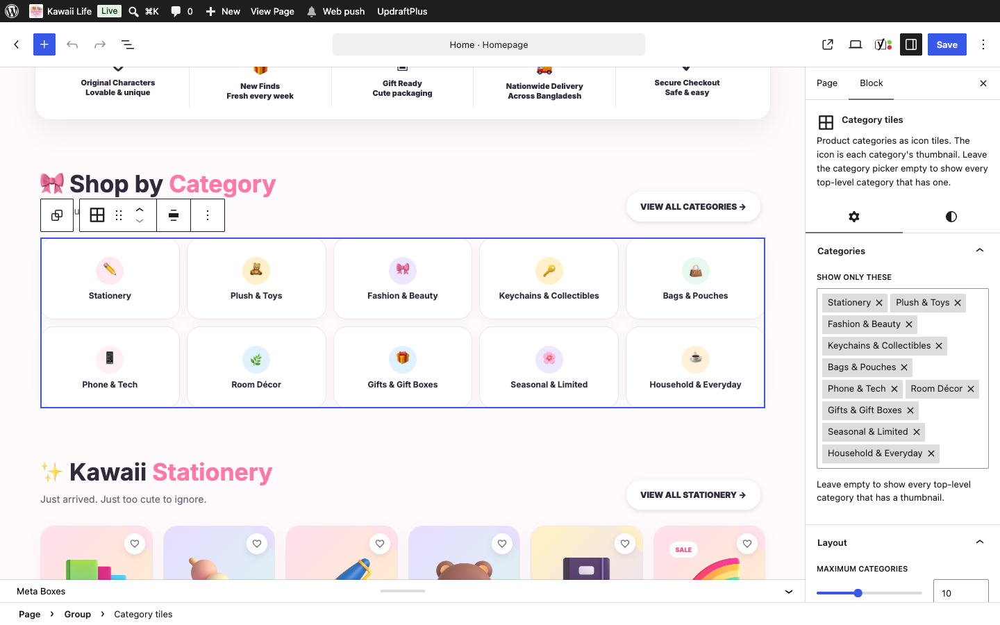

Each tile shows a product category with its **thumbnail** as the icon (see [8.1](#81-product-categories)).

- **Show only these**: pick the categories to show. Leave it empty to show every top-level category that has a thumbnail.
- **Maximum categories**, **Columns** and **Show product count** are in the same panel.

### 6.5 The product rows

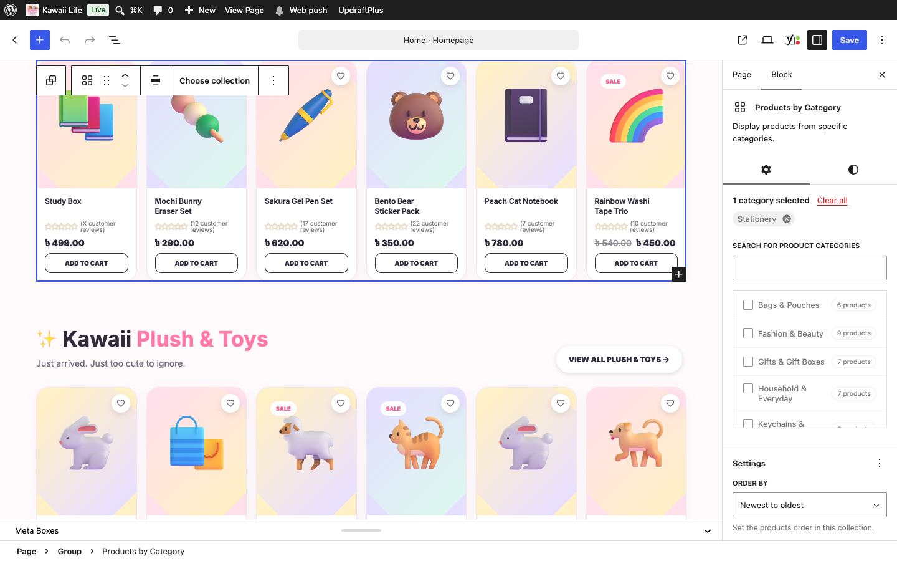

Each row ("Kawaii Stationery", "Kawaii Plush & Toys" …) is a heading plus a **Products by Category** block.

- Click the product cards, then on the right choose the **category** and the **Order by** (newest, best selling, price …).
- To change the heading or the "View all …" button, click it and type. Click the button and use the link icon to change where it goes.
- To add a row for another category, select a whole row's group in **List View**, **Duplicate** it, then change the category, heading and button on the copy.

### 6.6 On phones

The whole site adapts to phones and tablets by itself. You don't need to set anything up separately.

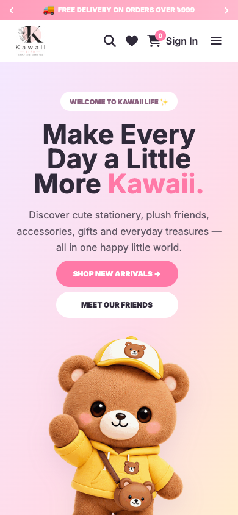

---

## 7. Products

**Where:** **Products → All Products**

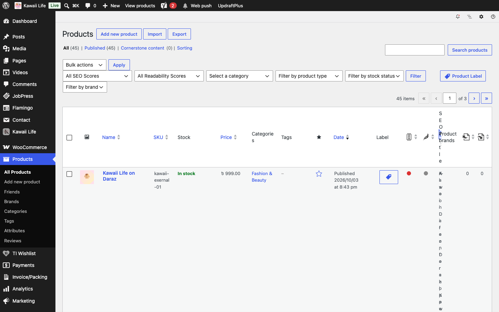

### 7.1 Adding or editing a product

1. Click **Add new product**, or hover over a product and click **Edit**.
2. Type the **product name** at the top and the **description** in the big box under it.
3. Fill in the **Product data** box (below the description):
   - **General**: the **Regular price** and, for a sale, the **Sale price**.
   - **Inventory**: the **SKU** (needed for barcode labels) and stock.
   - **Shipping**: weight and size, if you use them.
   - **Linked Products**: see [7.5](#75-you-may-also-like-and-complete-your-set).
   - **Attributes** and **Variations**: for sizes or colours (see [7.4](#74-products-with-colours-sizes-or-styles)).
   - **Product page**: Kawaii Life's own tab (see [7.3](#73-the-product-page-tab-taglines-video-shipping-and-returns-text)).
4. On the right:
   - **Product categories**: tick its category.
   - **Friends**: tick the character(s), if it's a character product.
   - **Product image**: the main photo. **Product gallery**: extra photos.
5. Click **Publish** (or **Update**).

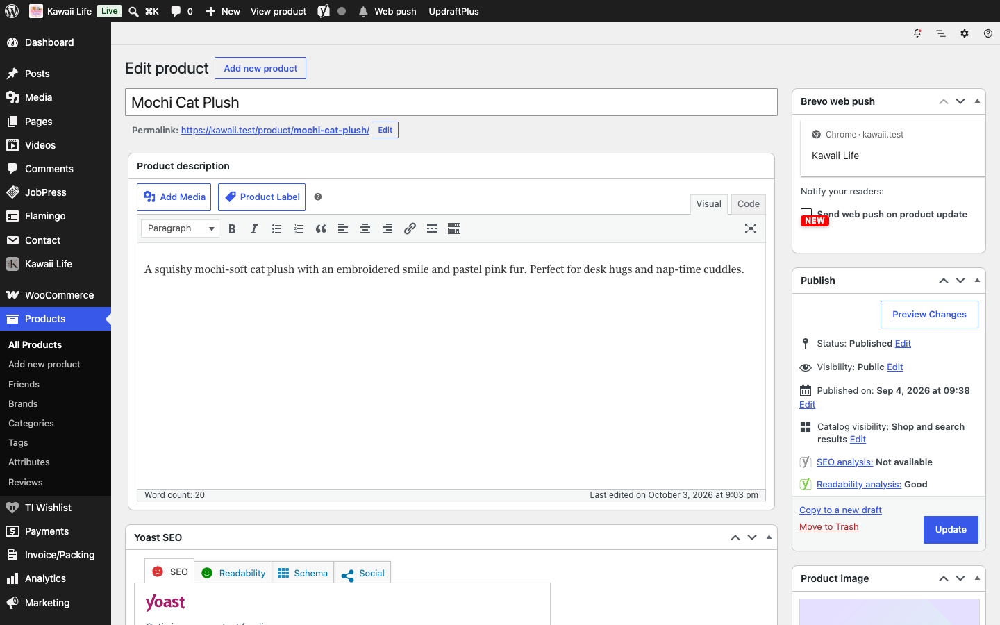

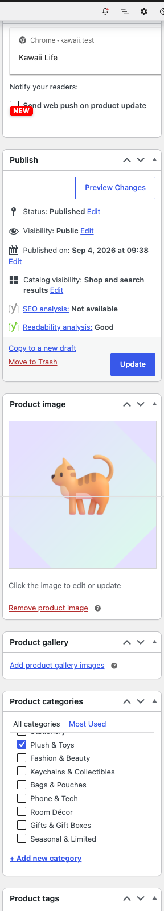

💡 **Product images.** Every product image on the site is a square picture with a cute 3D emoji on a soft gradient. Use square images, at least 800 × 800 pixels, to keep the shop consistent.

### 7.2 What shoppers see

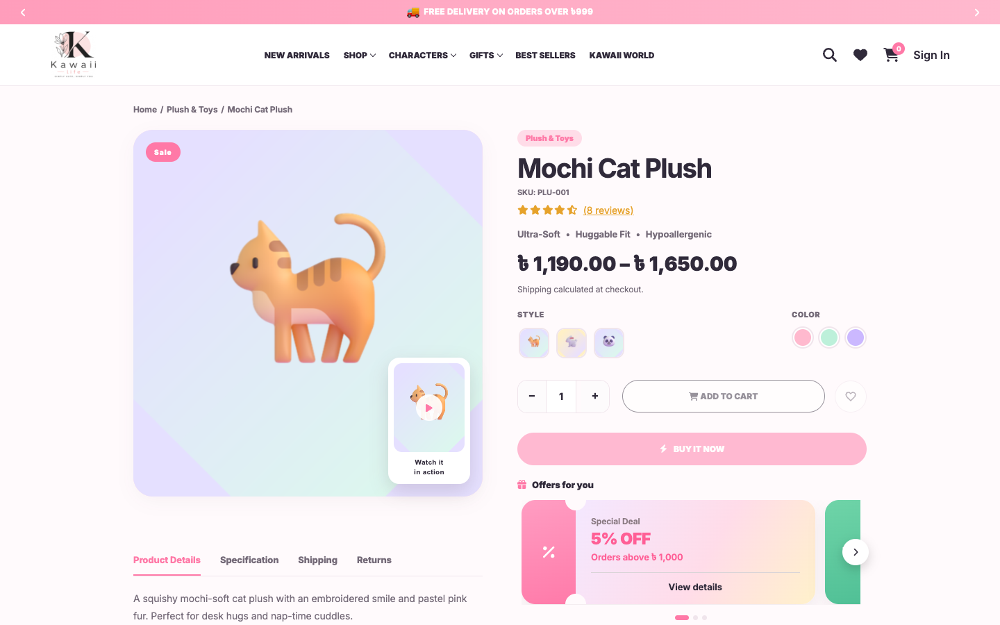

The product page brings together the gallery, price, the taglines, the colour or style choices, **Add to Cart** and **Buy It Now**, the expected delivery date, any **Offers for you**, the Description, Specification, Shipping, Returns and Reviews tabs, a video and **You May Also Like**.

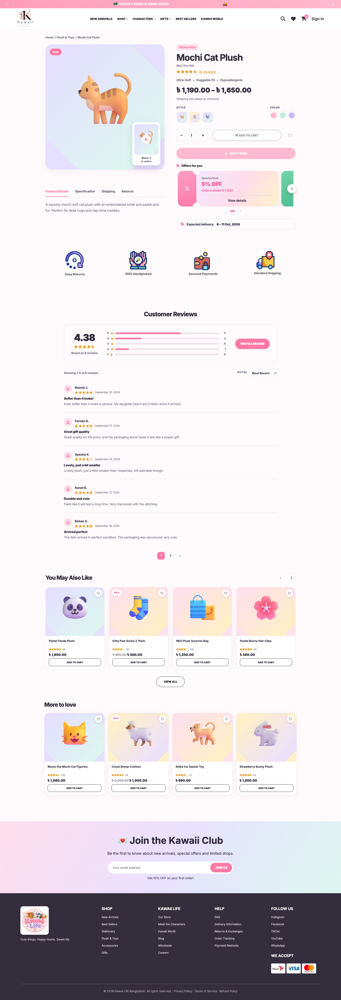

### 7.3 The Product page tab (taglines, video, shipping and returns text)

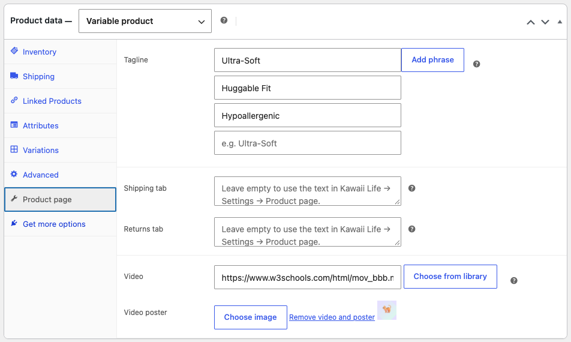

- **Tagline**: short phrases shown under the product name, joined with a dot: "Ultra-Soft • Huggable Fit • Hypoallergenic". Click **Add phrase** for another one. Empty boxes are ignored.
- **Shipping tab** / **Returns tab**: text for this product only. Leave them empty to use the shop's text from **Theme Options → Product page**.
- **Video**: shown as "Watch it in action". Click **Choose from library** to use an uploaded video, or paste a YouTube, Vimeo or .mp4 link.
- **Video poster**: the picture shown before the video plays.

### 7.4 Products with colours, sizes or styles

A product that comes in several options is a **Variable product**:

1. In **Product data**, change the drop-down at the top from *Simple product* to **Variable product**.
2. In **Attributes**, add an attribute (for example *Color*), pick its values and tick **Used for variations**. Click **Save attributes**.
3. In **Variations**, click **Generate variations**, then open each variation to set its price, stock and picture.

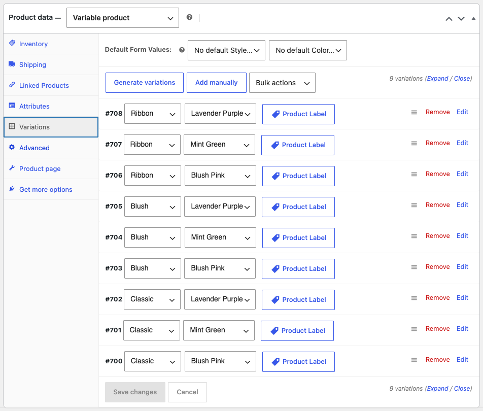

💡 Shoppers pick options from round colour dots or small image tabs instead of plain drop-downs. To set this up, see [8.3 Attributes](#83-attributes-colour-dots-and-image-swatches).

### 7.5 "You may also like" and "Complete your set"

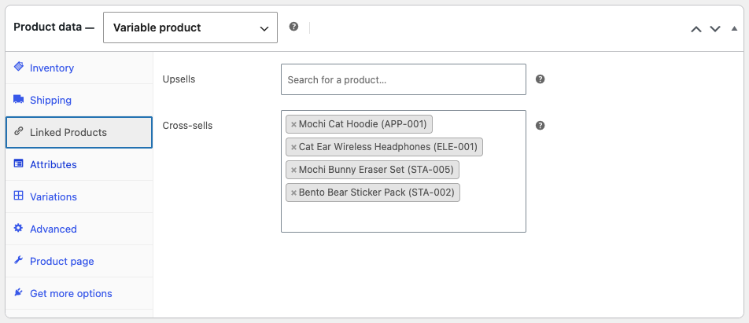

- **Cross-sells**: products shown in the cart drawer's **You may also like** row and under **You will love these** on the cart page when this product is in the cart. Use this for "complete your set".
- **Upsells**: WooCommerce's own "you may also like" suggestions.

The cart drawer fills any free spots with matching products by itself. It never suggests something already in the cart or out of stock.

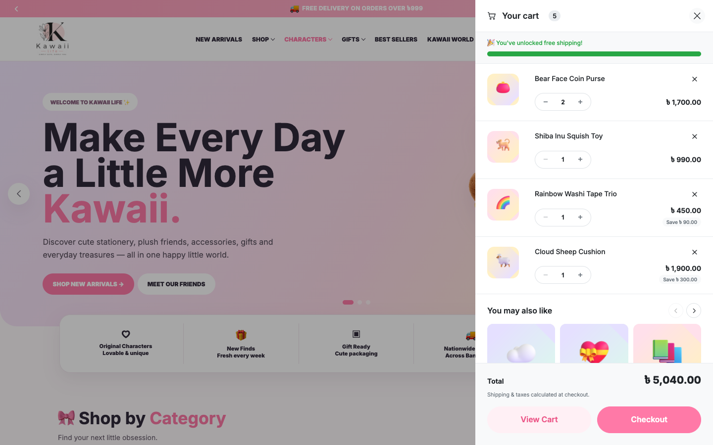

### 7.6 Reviews

**Where:** **Products → Reviews**

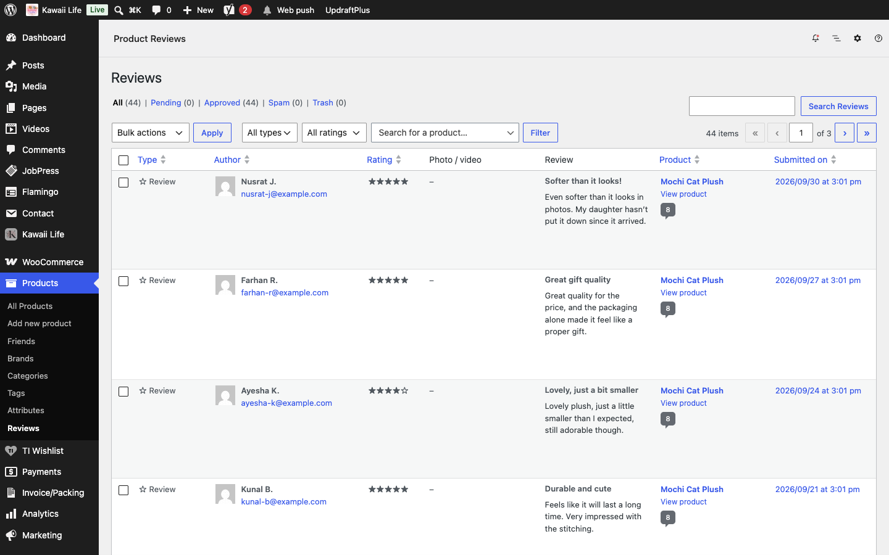

Customers can give a review a title and attach one photo or video. Reviews with a photo or video wait for you here:

- Hover over a review and click **Approve** to publish it, **Spam** or **Trash** to remove it.
- The **Photo / video** column shows what they attached. Check it before approving.

---

## 8. Categories, Friends and attributes

### 8.1 Product categories

**Where:** **Products → Categories**

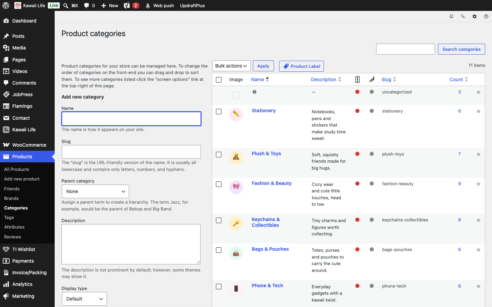

- **To add a category**, fill in **Name** (and an optional **Description**) on the left, then click **Add New Category**.
- **To edit one**, click its name.
- **Thumbnail**: the picture used as the category's icon in **Shop by Category** on the home page. A category without a thumbnail isn't shown there.
- **Description**: shown at the top of the category's page.

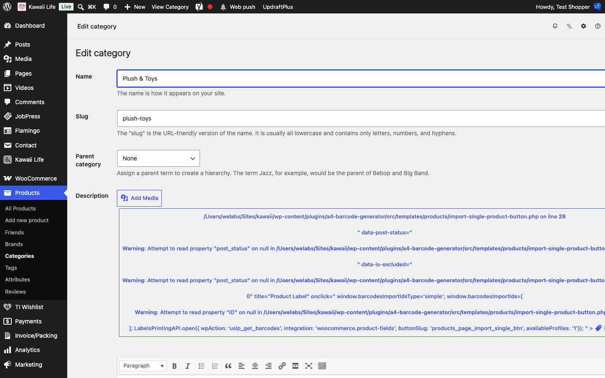

Each category has its own page on the site, with the shop's filters:

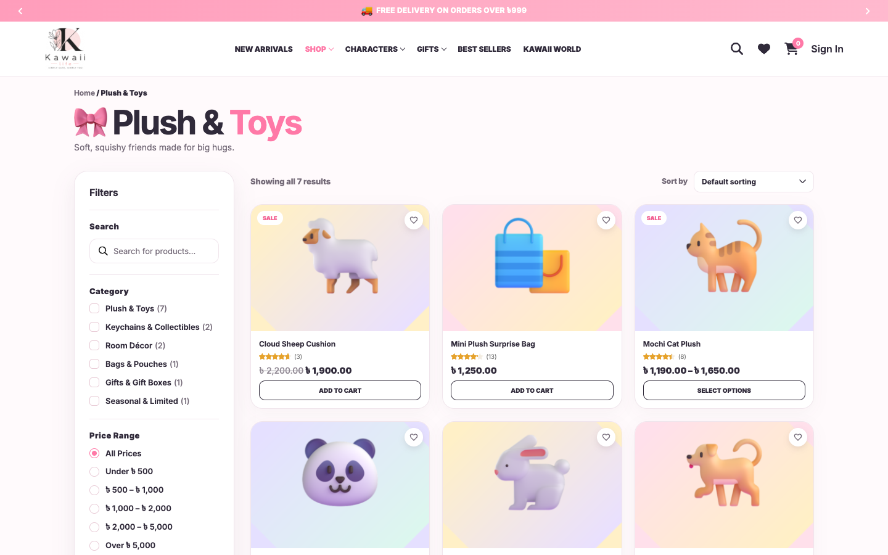

### 8.2 Friends (the characters)

**Where:** **Products → Friends**

Friends are the Kawaii Life characters: Momo, Bubu, Mimi, Pipi and Coco. Each friend has its own page listing its products, and appears on the home page.

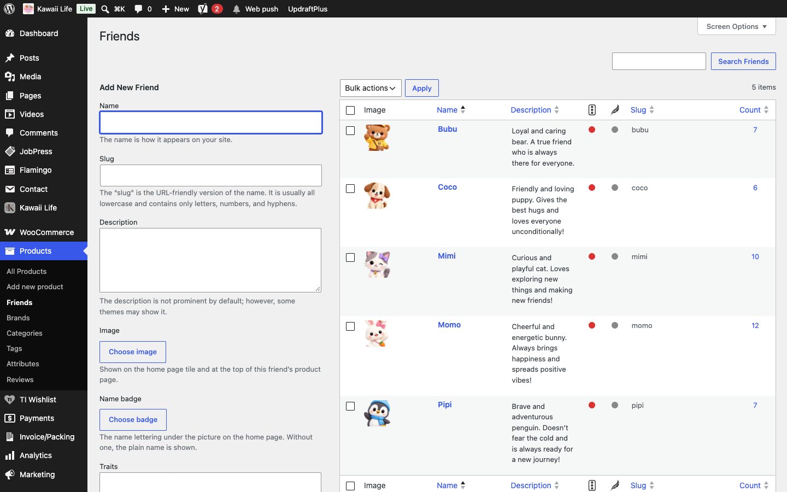

Click a friend to edit it:

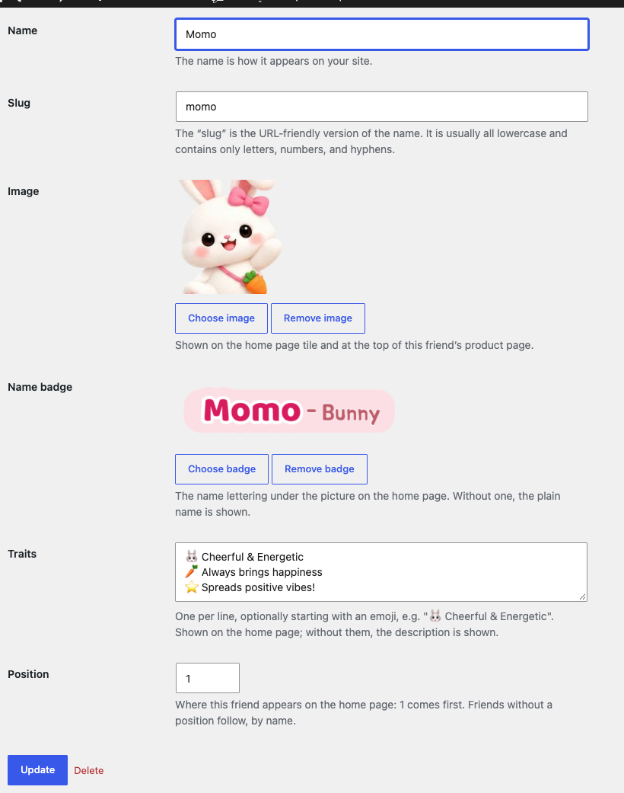

- **Image**: the character picture on the home page and at the top of its product page.
- **Name badge**: the name lettering under the picture ("Momo – Bunny"). Without one, the plain name is shown.
- **Traits**: one per line, optionally starting with an emoji, for example `🐰 Cheerful & Energetic`.
- **Position**: the order on the home page (1 comes first).

To link a product to a friend, tick the friend in the **Friends** box when you edit the product. A new friend shows up on the home page and in the Characters section automatically.

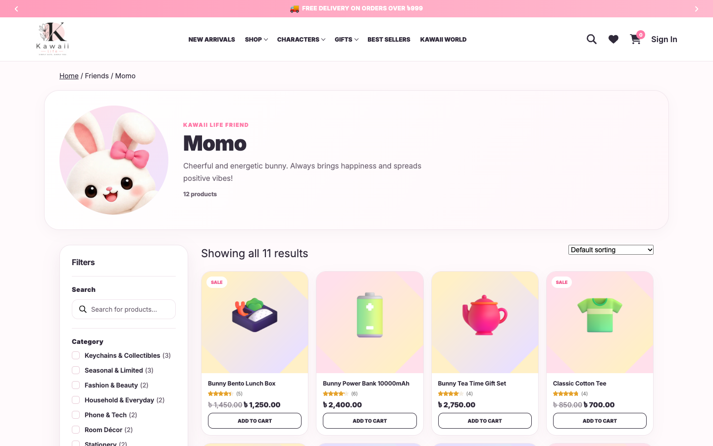

### 8.3 Attributes (colour dots and image swatches)

**Where:** **Products → Attributes**

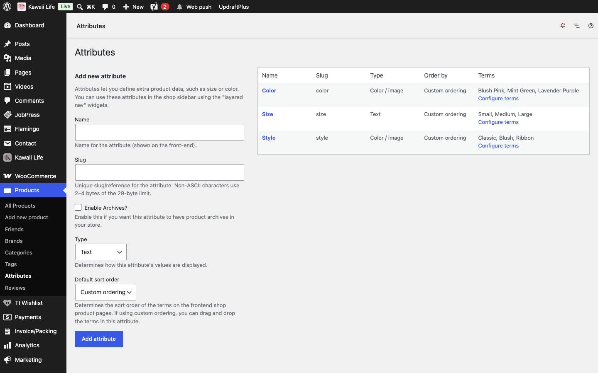

When you add or edit an attribute, set its **Type** to **Color / image**. Then, for each value (click **Configure terms**):

- set a **Color** to show a round colour dot, or
- set an **Image** to show a small picture tab.

---

## 9. Coupons and "Offers for you"

**Where:** **Marketing → Coupons**

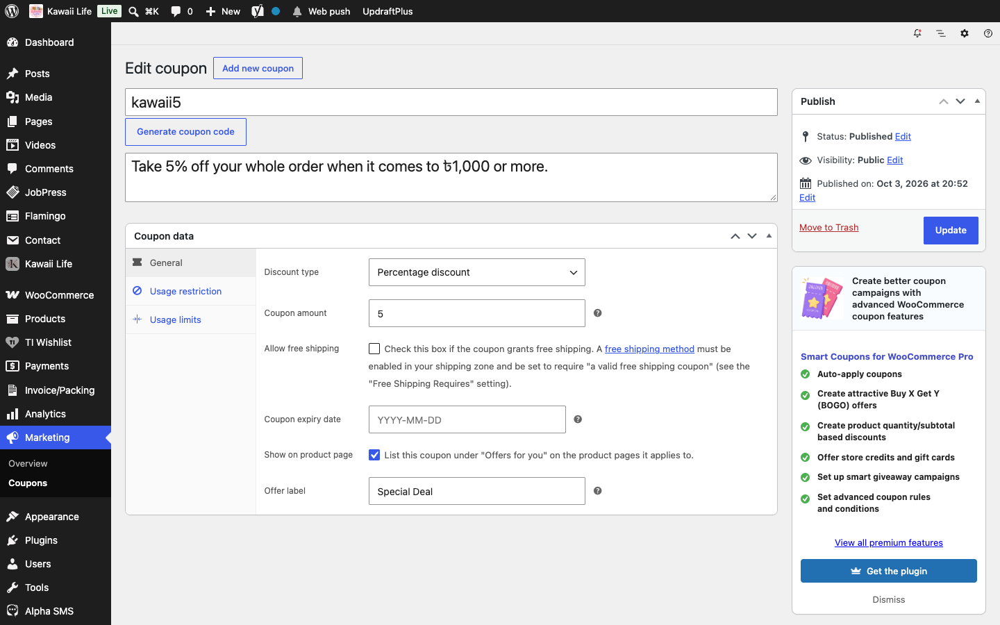

1. Click **Add coupon**.
2. Type the **coupon code** customers will enter (for example `KAWAII5`).
3. Under **Coupon data → General**, choose the **Discount type** and **Coupon amount**, and an optional **Coupon expiry date**.
4. Under **Usage restriction**, set a minimum spend or limit it to certain products or categories.
5. **Show on product page** (Kawaii Life's own option): tick it to list this coupon under **Offers for you** on every product page it applies to.
6. **Offer label**: the small line on the offer card, such as "Special Deal".
7. Click **Publish**.

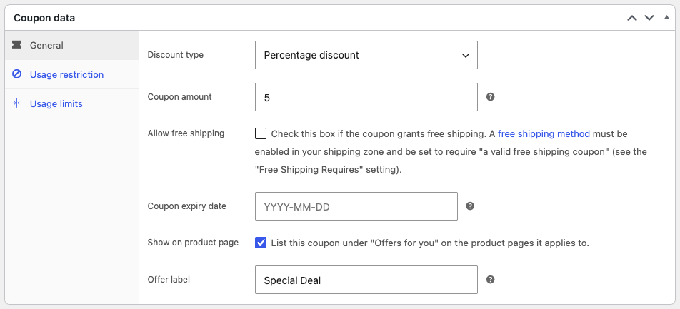

On the product page, it looks like this:

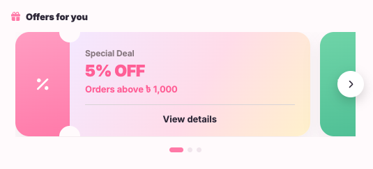

---

## 10. Orders

**Where:** **WooCommerce → Orders**

- **New orders** appear at the top. The number next to **Orders** in the menu is how many are waiting.
- Use the status links above the list (**Processing**, **On hold**, **Pending payment** …) to filter.
- 💡 **Pending payment** lists orders that were started but not paid: your incomplete orders.
- Search by order number, customer name, phone or email with the box at the top-right. A barcode scanner works here too: scan an invoice or order label to find the order.

### 10.1 Handling an order

Click an order to open it.

- **Status**: change it as the order moves along, then click **Update**:
  - **Pending payment**: started, not paid.
  - **Processing**: paid or Cash on Delivery; pack it.
  - **On hold**: waiting for you to confirm a bank payment.
  - **Completed**: delivered.
  - **Cancelled**, **Refunded**, **Failed**.
- **Shipping** shows the delivery address and phone, and the **Estimated delivery** dates the customer was promised.
- **Billing** is filled in from the delivery address automatically. Customers only ever see their delivery address.
- **To change items**, set the order's status to **On hold** or **Pending payment** first. Then use **Add item(s)**, change quantities, or click **×** on an item, and click **Recalculate**.
- **Order notes** (right): add a **Private note** for your team, or a **Note to customer**, which emails them.
- **Order actions** (top-right): resend the order emails to the customer.

💡 Customers get an email when their order is received, starts processing and is completed. Their order page in **My Account** and the **Order Tracking** page show the same status.

---

## 11. Invoices, packing slips and labels

### 11.1 From an order

Each order has an **Invoice/Packing** box on the right with print and download buttons for the **Invoice**, **Packing slip**, **Delivery note**, **Shipping Label** and **Dispatch Label**.

- Invoices are numbered **KL-** plus the order number (KL-699).
- An invoice is created automatically when the order becomes **Processing** or **Completed**, attached to the customer's email, and downloadable from their **My Account**.
- The barcode on the invoice is the plain order number, so scanning it in **Orders** finds the order.

**Settings:** **Invoice/Packing → General Settings** (shop address, logo) and the **Invoice**, **Packing slip** and other pages under it.

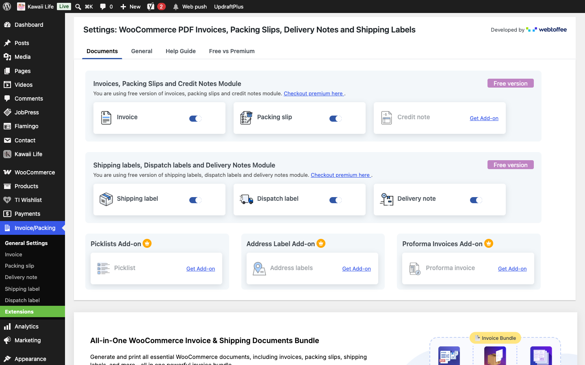

⚠️ Add the shop's phone number in **Invoice/Packing → General Settings** so it prints in the invoice's "From" block.

### 11.2 Barcode labels

**Where:** **Label Printing**

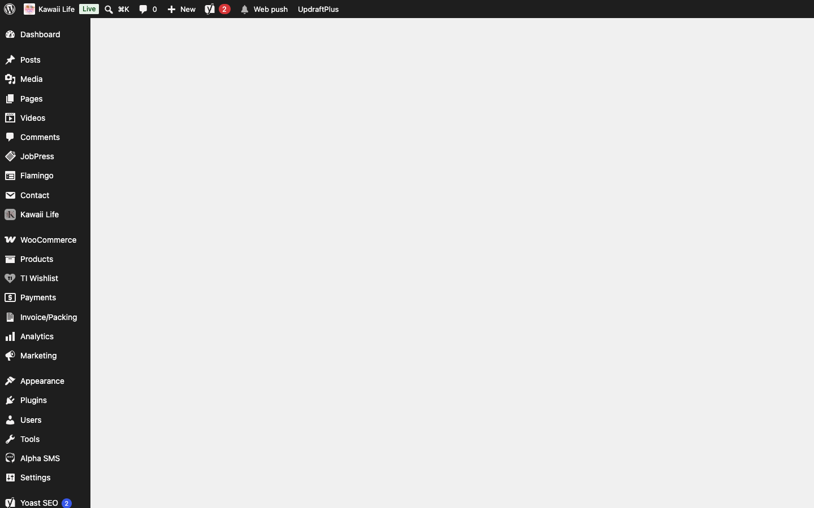

- **Product labels**: in **Products → All Products**, tick products and click **Product Label** (or use **Label Printing → From "Products" page**). Each label has a barcode of the product's **SKU** and its name, 12 to an A4 sheet.
- **Order labels**: in an order, the **Labels** box has **Order Label** and **Product labels** buttons.

⚠️ A product without a SKU can't get a barcode. Add a SKU under **Product data → Inventory**.

⚠️ Don't update the **Barcode Label Printing** plugin past version 4.0.0 until its makers fix version 4.0.1, which is broken.

---

## 12. Delivery zones, charges and dates

**Where:** **WooCommerce → Settings → Shipping**

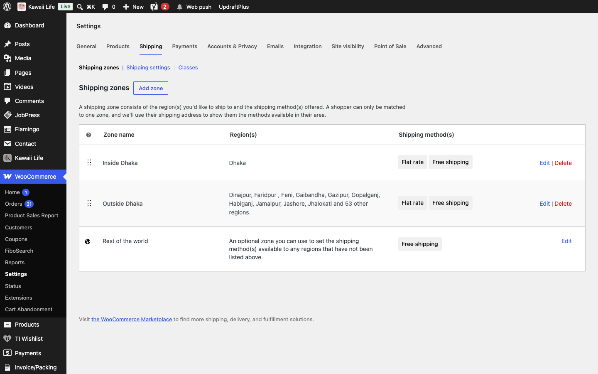

- Each **zone** (Inside Dhaka, Outside Dhaka …) lists the districts it covers and its **shipping methods** with their charges, including free delivery over a minimum amount.
- Click a zone's name to change its regions or its charges.
- The delivery **days** for each zone are set in **Kawaii Life → Theme Options → Delivery** ([section 2.4](#24-delivery)).

At checkout, customers choose their **District** and **Area / Thana**, and the charge for their zone is added automatically. The cart and cart drawer show a progress bar towards free delivery.

---

## 13. Customers, sign-up and saved addresses

### 13.1 How customers sign up and log in

Customers sign up on the **Sign up** page with their name, email, mobile number and a password. A code is texted to their phone to confirm it. They log in with their **phone number and a texted code**.

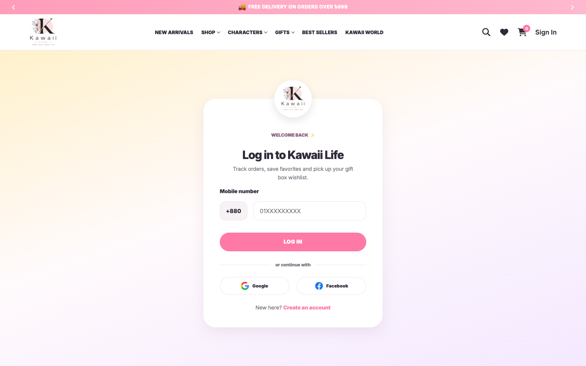

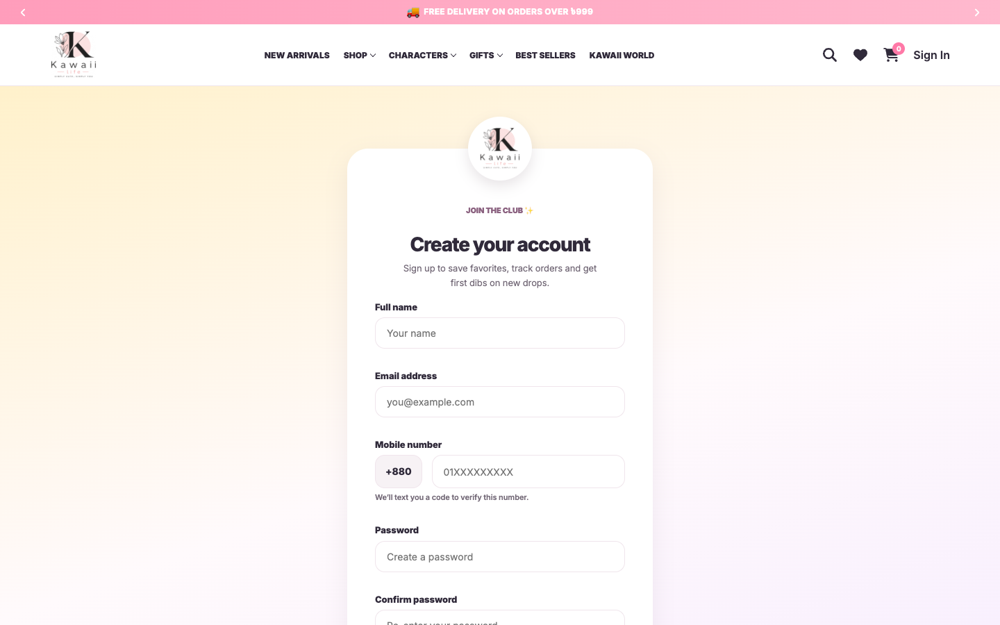

- Codes are sent through **Alpha SMS**, so keep its balance topped up (see [section 20](#20-sms-email-and-newsletter)).
- **To stop new sign-ups**, go to **WooCommerce → Settings → Accounts & Privacy** and untick **Allow customers to create an account on the "My account" page**.

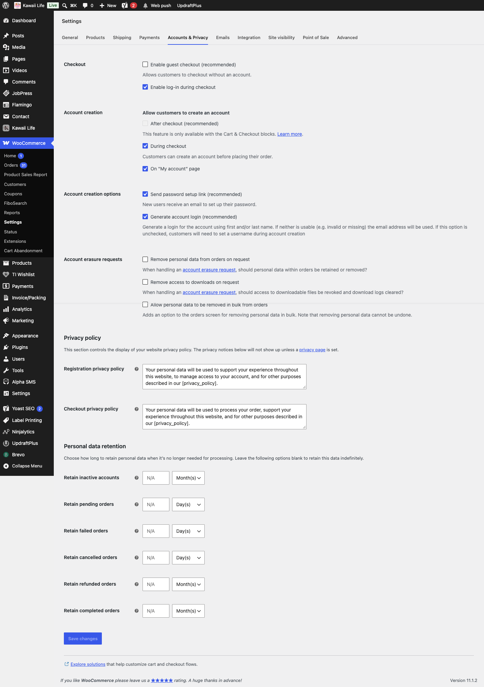

- Checkout is for signed-in customers only. A shopper who isn't signed in is asked to log in with their phone first.

### 13.2 Looking up a customer

**Where:** **Users → All Users** (or **WooCommerce → Customers**)

Click a customer to see their details. At the bottom, **Saved Addresses** lists their delivery addresses, the same ones they see in My Account. You can edit them here; the **Default** one is used at checkout.

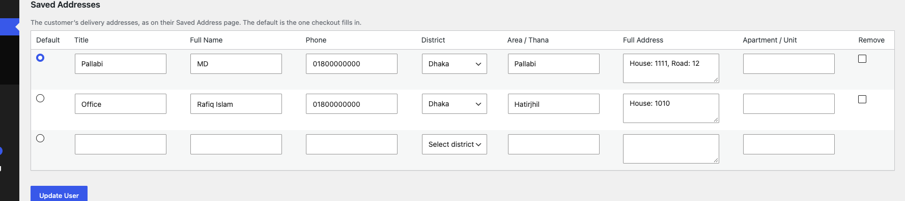

### 13.3 Staff accounts

**Where:** **Users → Add User**

Give each staff member their own account and a **Role**:

- **Shop Manager**: orders, products, coupons and reports, but not site settings or plugins. Best for most staff.
- **Editor**: pages and blog posts only.
- **Administrator**: everything. Keep this to one or two people.

---

## 14. What customers see: cart, checkout and My Account

You don't need to set these up; they're shown here so you know what customers see.

**Cart**: with the free-delivery progress bar and "You will love these" suggestions.

**Checkout**: Contact Information, one Shipping Address (they can pick a saved one under **Deliver to**), payment, and the Order Summary.

**My Account**: a greeting, order and wishlist counts and the latest orders. The menu on the left has My Orders, Downloads, Saved Address, My Wishlist, Account Management (name, phone, photo) and Change Password.

**One order**: status, estimated delivery, items, delivery address and invoice.

**Wishlist**: saved products with Add to Cart.

The wishlist's own options (who can use it, sharing, button text) are under **TI Wishlist → General Settings**.

**Search**: the search box in the header and the shop sidebar suggests products with their prices as the shopper types. Its options are under **WooCommerce → FiboSearch**.

---

## 15. Wishlists, searches and carts (activity logs)

**Where:** **Kawaii Life → Wishlist Logs / Search Log / Cart Log**

These pages show what shoppers are interested in. Use them to plan stock and promotions.

**Wishlist Logs**: every wishlist and the products on it. Click a wishlist to see its items. **Customers** and **Guests** filter the list.

**Search Log**: what shoppers searched for and whether anything came up. Searches with no results tell you what people want that you don't sell yet.

**Cart Log**: products added to carts, by whom and when.

### 15.1 How "Just for You" recommendations work

Click **How Recommendation Engine Works** at the top of any log page for a full explanation. In short: the shop watches what each shopper searches for, adds to their cart and saves to their wishlist, and shows them similar products, matched by **category and tags**.

💡 The better your categories and tags, the better the suggestions. Give every product a category and a few tags (for example *bunny*, *pastel*, *plush*).

To show the recommendations on a page, add the **Just for You** block.

---

## 16. Videos and the Kawaii World page

**Where:** **Videos**

The Kawaii World page shows brand videos: the big video at the top, the crew videos and the reels. Videos are uploaded once here and reused on any page.

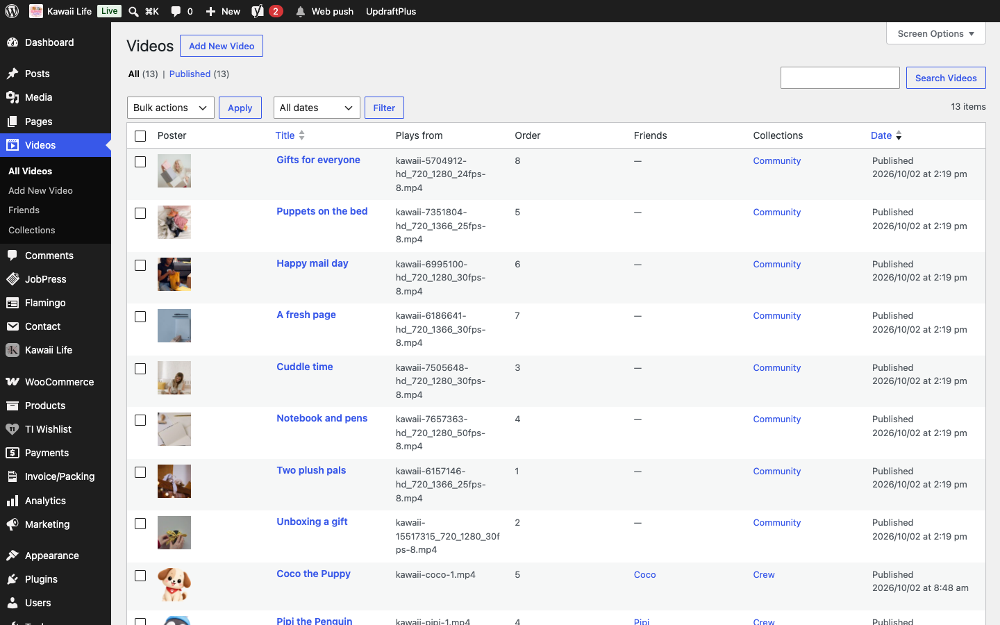

**To add a video:**

1. Click **Add New Video** and type a title.
2. In the **Video** box, click **Choose or upload MP4 / WebM**, or paste an external MP4 link.
3. **Products in this video** (up to three): shoppers can add them to their cart from the video player.
4. On the right:
   - **Friends**: the character in the video (crew videos show the friend's name and traits).
   - **Collections**: which row the video belongs to, such as *Crew* or *Community*.
   - **Poster**: the picture shown before the video loads.
   - **Order** (under *Post Attributes*): its position in the row.
5. Click **Publish**.

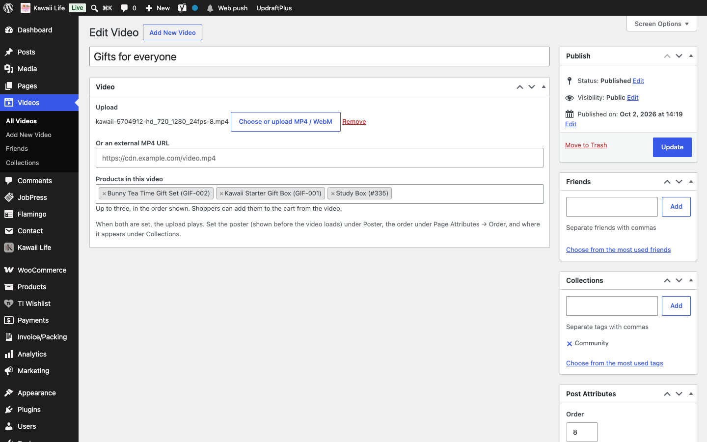

**Collections** (**Videos → Collections**) are the rows. The **Video Hero**, **Crew Grid** and **Reels** blocks on the Kawaii World page each show one collection, so a new video in that collection appears on the page without editing it.

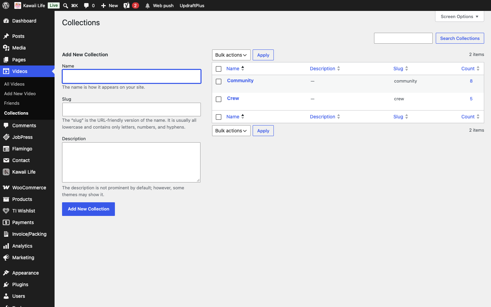

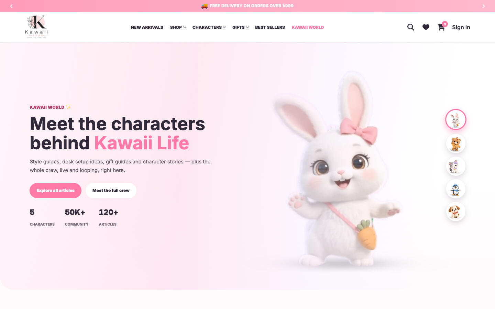

To change the Kawaii World page's text and buttons, edit **Pages → Kawaii World**. Click a video block to choose which collection it shows.

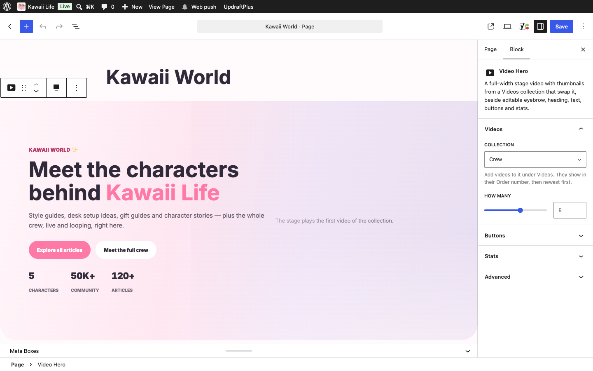

---

## 17. The blog

**Where:** **Posts**

The **Blog** page (`/blog/`) lists your articles with a sidebar of search, categories, recent posts and tags.

**To write an article:**

1. Click **Posts → Add Post**.
2. Type the title and the article.
3. On the right, under **Post**, choose a **Category**, add **Tags**, and set a **Featured image** (the cover picture on the blog cards and at the top of the article).
4. Click **Publish**.

💡 Each article page ends with "More to read" (three related articles) and comments. Approve or delete comments under **Comments**.

⚠️ The articles' author shows as "Test Shopper". Change your display name under **Users → Profile → Display name publicly as**, or choose another author on each post (**Post → Author**).

---

## 18. Information pages

All of these are ordinary pages under **Pages**, built from Kawaii Life's blocks, so you edit them like any page ([section 5](#5-editing-pages-the-basics)).

| Page | What to know |
| --- | --- |
| **About Us** | Diary-style blocks: Story Cover, Story Entry, Postcard, Sticker Sheet. The Sticker Sheet lists the Friends automatically. |
| **FAQ** | Each question is an **FAQ Item** inside an **FAQ** block. Click a question or answer to edit it. To add one, select an FAQ Item, click **⋮ → Duplicate**, then edit the copy. Questions on this page are also shown to Google as an FAQ. |
| **Delivery Information** | Delivery zones, times and charges are typed into the **Delivery Zones** block. ⚠️ They don't update from your shipping settings, so change them here if your charges change. |
| **Returns & Exchanges** | Return steps, what can be returned, and the **Return request** form. |
| **Wholesale** | Price tiers and the wholesale inquiry form. |
| **Order Tracking** | Shoppers type their order number and their email or phone to see the order's status and timeline. Nothing to set up. |
| **Careers** | Job openings come from **JobPress** (see below). |
| **Privacy Policy**, **Terms of Service** | **Policy** blocks. Each numbered **Policy Section** is listed under "On this page". |
| **Payment Methods** | ⚠️ Empty. Add your payment information here before launch. |

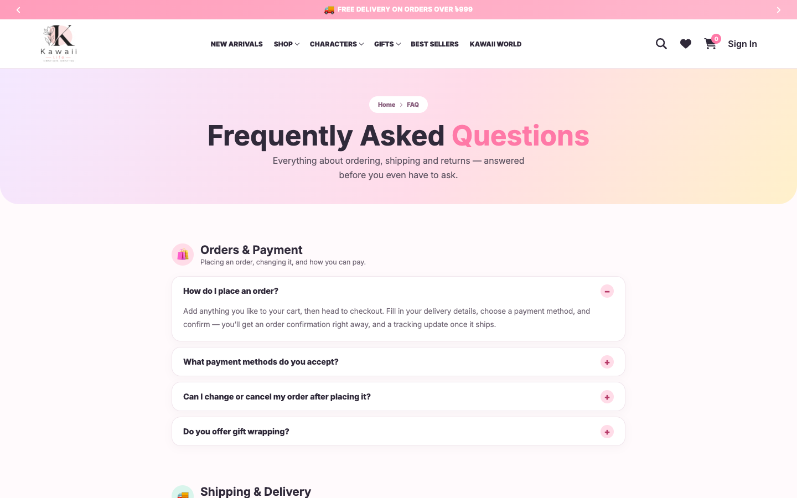

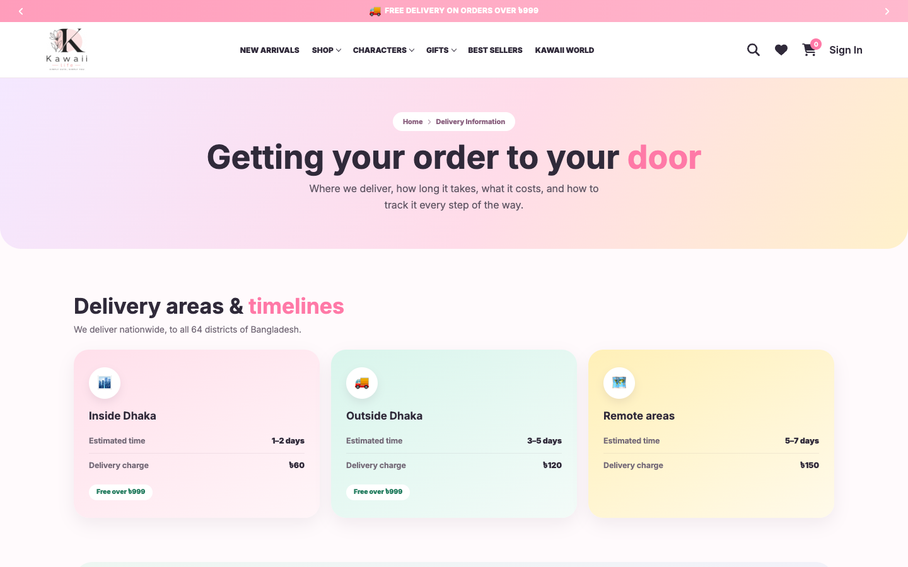

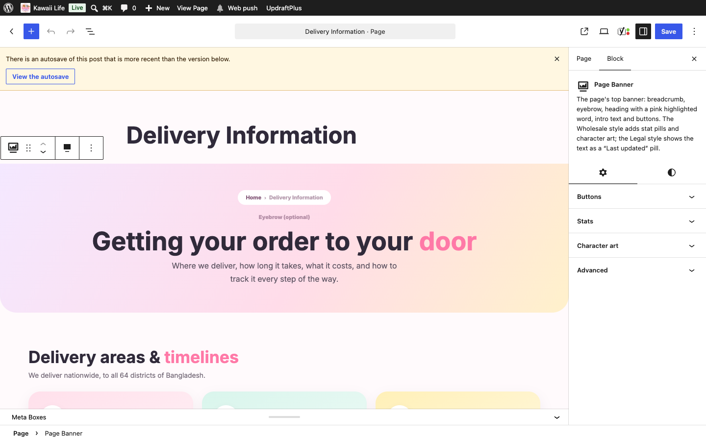

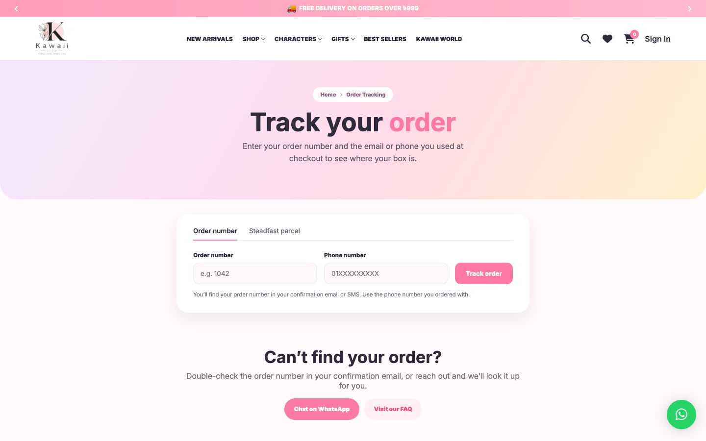

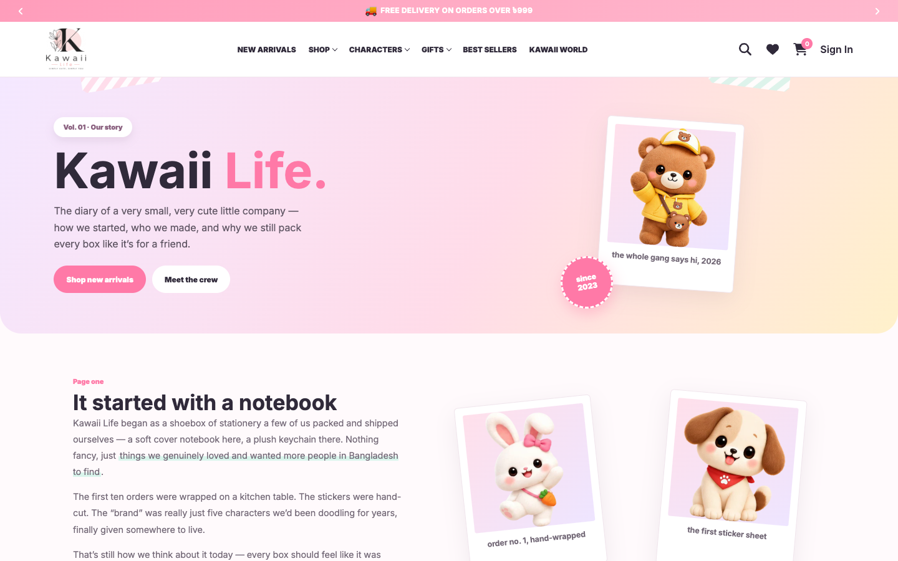

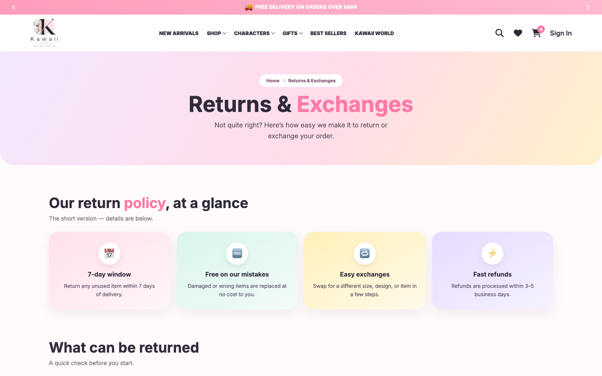

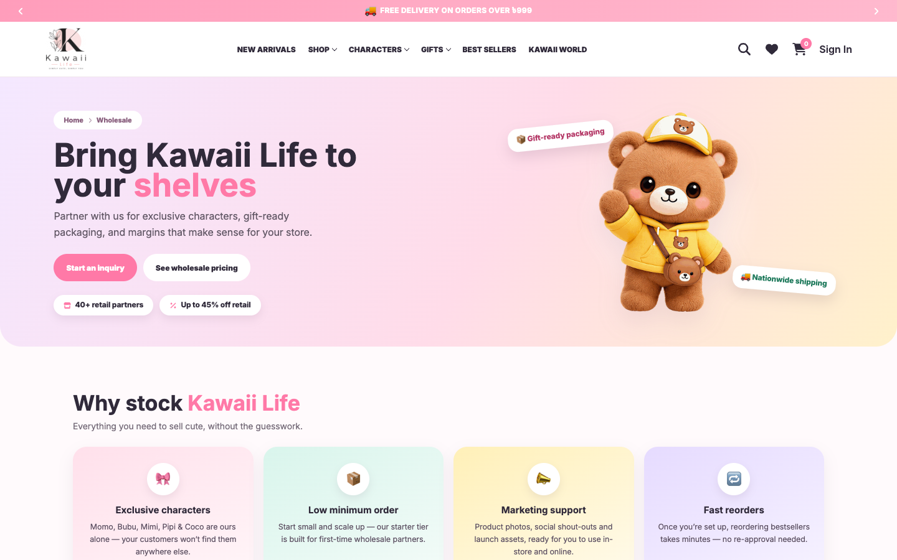

### 18.1 Careers (jobs)

**Where:** **JobPress → All Jobs**

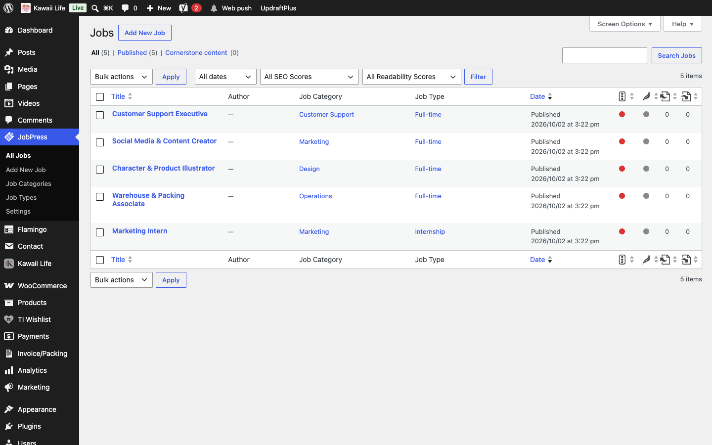

1. Click **Add New Job**, type the job title and description.
2. Choose its **Job Categories** (team) and **Job Types** (full-time, part-time).
3. Fill in the job details (deadline, how to apply) and click **Publish**.

The job appears on the **Careers** page automatically. **JobPress → Settings** decides whether applications come by email or through a form.

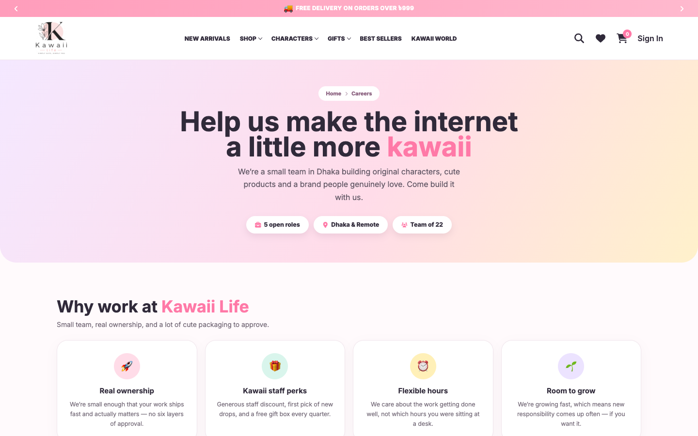

---

## 19. Forms and messages

**Where:** **Contact → Contact Forms** (the forms) and **Flamingo → Inbound Messages** (what people sent)

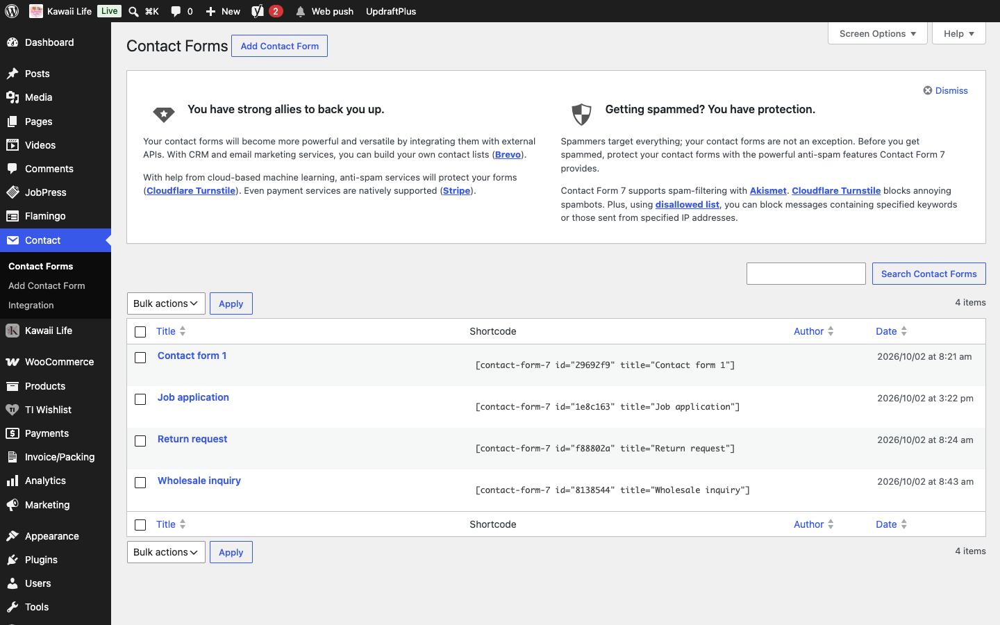

- The **Return request** and wholesale inquiry forms are made with Contact Form 7.
- Each message is emailed to you and also saved in **Flamingo → Inbound Messages**, so nothing gets lost.
- To change who gets the email, open the form, click the **Mail** tab and change **To**.

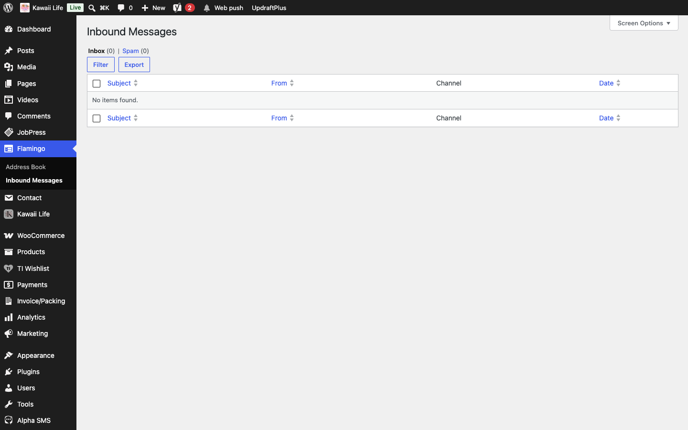

---

## 20. SMS, email and newsletter

### 20.1 SMS (Alpha SMS)

**Where:** **Alpha SMS → Settings**

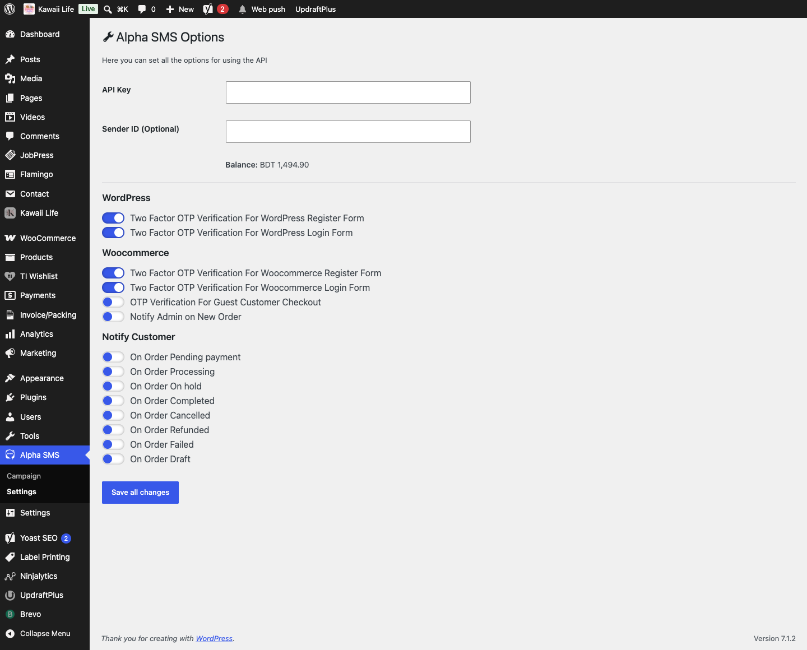

Alpha SMS sends the login and sign-up codes, and can text customers when their order changes status.

- **Balance** shows how much SMS credit is left.
- **Notify Customer**: switch on the order statuses you want a text for (for example *Processing* and *Completed*), then click **Save all changes**.
- **Notify Admin on New Order** texts you when an order comes in.
- **Alpha SMS → Campaign** sends one message to many customers at once.

⚠️ If the balance runs out, customers can't log in or sign up. Top it up on your Alpha SMS account. The record of sent messages is on the Alpha SMS website.

⚠️ Leave the **API Key** as it is; it connects the site to your Alpha SMS account.

### 20.2 Order emails

**Where:** **WooCommerce → Settings → Emails**

Each email (New order, Processing order, Completed order …) can be switched on or off and its subject and heading changed. The **Email sender options** at the bottom set the "From" name and address.

### 20.3 Newsletter (Brevo)

**Where:** **Brevo → Forms**

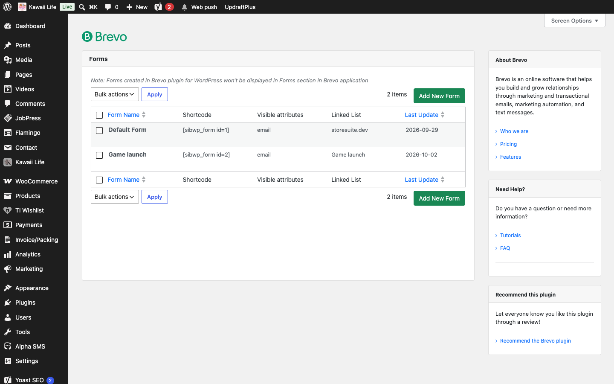

The **Join the Kawaii Club** form in the footer is the Brevo form **Default Form**. Edit it here to change its fields, button and messages. New subscribers go to your Brevo contact list, where you send newsletters from your Brevo account.

---

## 21. SEO (Google and social sharing)

**Where:** **Yoast SEO**, plus a **Yoast SEO** box under every page, post and product

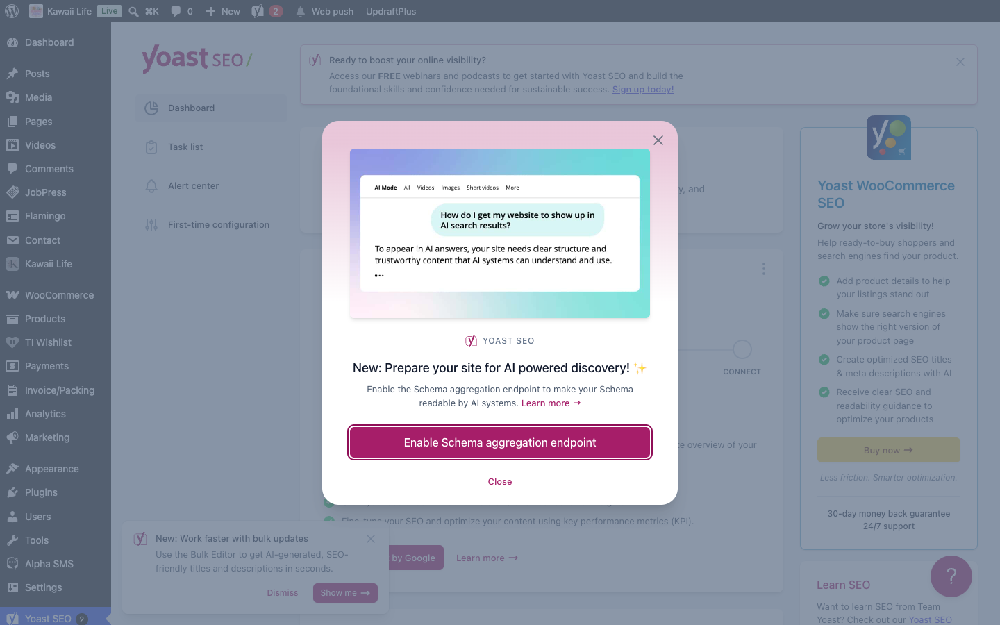

- Every main page already has an SEO title and description.
- When you add a product, page or post, scroll down to the **Yoast SEO** box and fill in the **SEO title** and **Meta description**. The preview shows how it will look on Google.
- When you share a link on Facebook or WhatsApp, the picture and text come from the **Social** tab of that box.

⚠️ **At launch**, go to **Settings → Reading** and **untick** "Discourage search engines from indexing this site". Until then, Google is asked not to list the site.

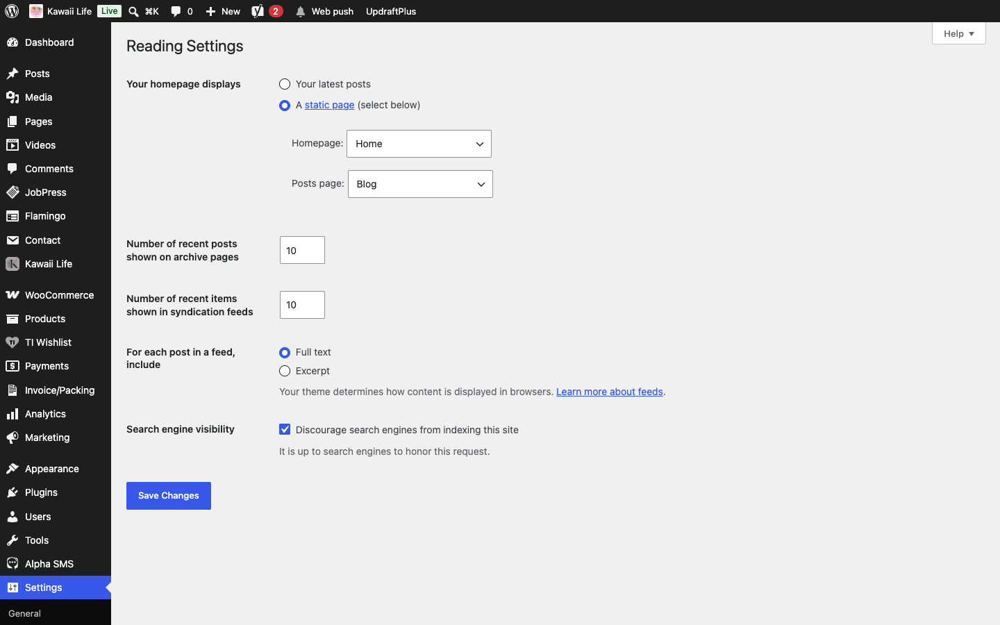

---

## 22. Reports

- **Analytics → Overview**: sales, orders and the best-selling products for any date range. **Analytics → Stock** shows low and out-of-stock products.

- **Ninjalytics** (**WooCommerce → Product Sales Report**): sales by product, and order exports to a spreadsheet.

- **WooCommerce → Cart Abandonment**: carts that were started but not checked out, and the recovery emails sent for them.

- **Kawaii Life → Search Log / Cart Log / Wishlist Logs**: see [section 15](#15-wishlists-searches-and-carts-activity-logs).

---

## 23. Backups

**Where:** **Settings → UpdraftPlus Backups** (or **UpdraftPlus** in the menu)

- Click **Backup Now** before any big change, such as updating plugins.
- Under **Settings**, set automatic backups (for example daily database, weekly files) and connect remote storage such as Google Drive, so a copy is kept off the server.
- **Restore** brings the whole site back to a saved backup.

---

## 24. Not live yet

These parts of the agreed project are still being finished. Until they're done, the site behaves as described here:

| Feature | Today |
| --- | --- |
| **bKash, Nagad and SSLCommerz payments** | Only Cash on Delivery and Bank Transfer are on (**WooCommerce → Settings → Payments**). |
| **Steadfast and Pathao courier** | Not connected. Book deliveries with the courier directly. |
| **Confirmed, Shipped, Delivered and Returned order statuses** | Use WooCommerce's statuses (section 10.1). The Order Tracking timeline completes when an order is **Completed**. |
| **COD verification, payment, abandoned-cart and promotional SMS** | Not built yet. Order SMS and login codes work. |
| **NEW and BESTSELLER badges** | Product cards show only the Sale badge. |
| **Gift box bundles** | Gift boxes are sold as ordinary products. |
| **"Just for You" on the home page** | The block exists; it will be added to the home page. |
| **Footer social links and WhatsApp chat button** | Social links point nowhere until you add your profiles (section 4). The WhatsApp button needs the shop's number. |
| **Google and Facebook login buttons** | They're shown on the login card but don't work yet. |
| **Order email branding** | Emails use WooCommerce's default look. |
| **Blocking fraudulent customers** | Not available yet. |
| **Payment Methods page** | Empty; needs your content. |

---

## 25. Quick answers

**I changed something but the site looks the same.**
Make sure you clicked **Save** / **Update** / **Save Changes**. Then reload the page on the site (Ctrl + Shift + R on Windows, ⌘ + Shift + R on Mac).

**I broke a page.**
Open it, go to **Page → Revisions** on the right, and restore an earlier version.

**A product doesn't show on the home page.**
The home page rows show products from one category each. Check the product's category and that it's **Published** and in stock.

**A category isn't in "Shop by Category".**
Give the category a **Thumbnail** (Products → Categories → Edit).

**A friend's picture or traits are missing on the home page.**
Edit the friend under **Products → Friends** and fill in **Image**, **Name badge** and **Traits**.

**A customer says they didn't get their login code.**
Check your Alpha SMS balance, and that they typed their number as `01XXXXXXXXX`.

**A customer wants to change their delivery address on an order.**
Open the order, click the pencil ✏️ next to **Shipping**, change it and click **Update**.

**How do I print today's packing slips?**
In **WooCommerce → Orders**, tick the orders, choose **Print Packing slip** from **Bulk actions** and click **Apply**.

**Who do I call when something's really wrong?**
Revo Interactive, who built the site. Note the page address and what you clicked, and take a screenshot if you can.

---

*Kawaii Life Site Owner's Guide · prepared by Revo Interactive · October 2026*
