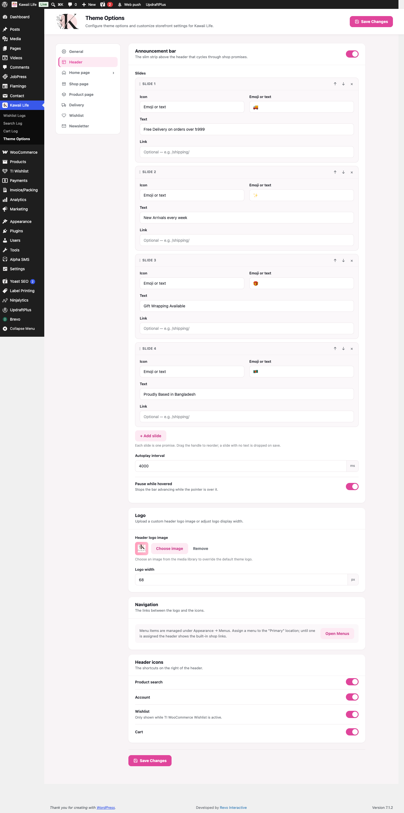
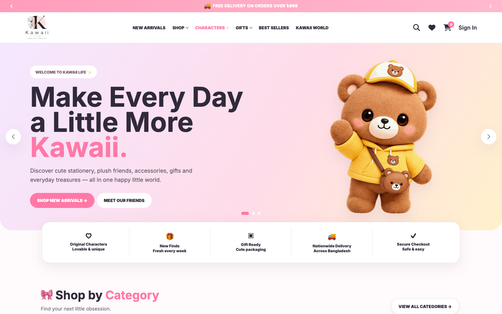
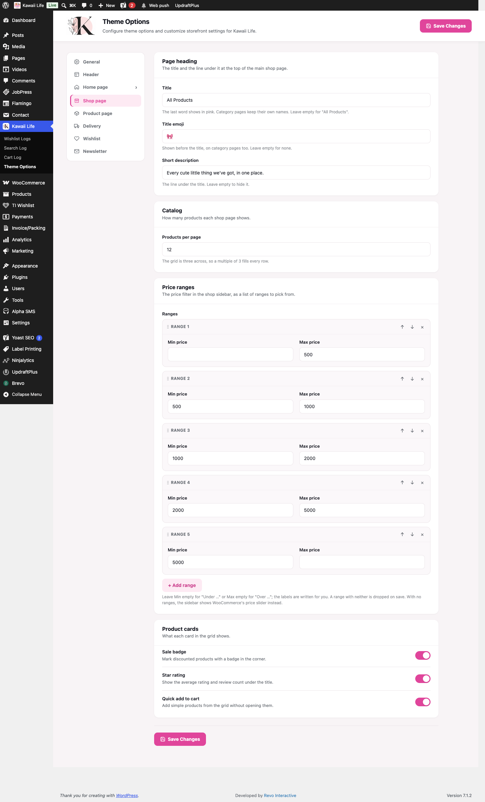
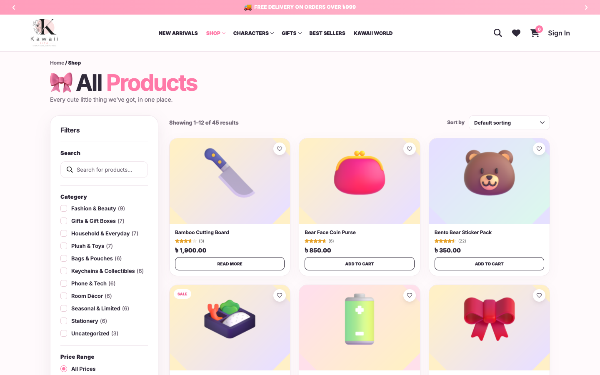
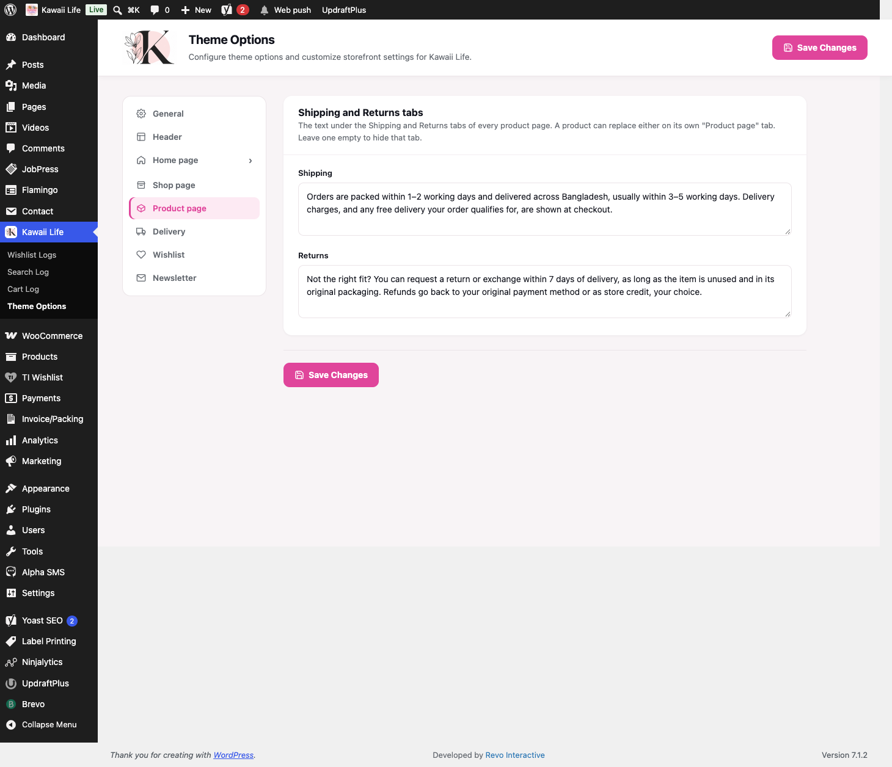
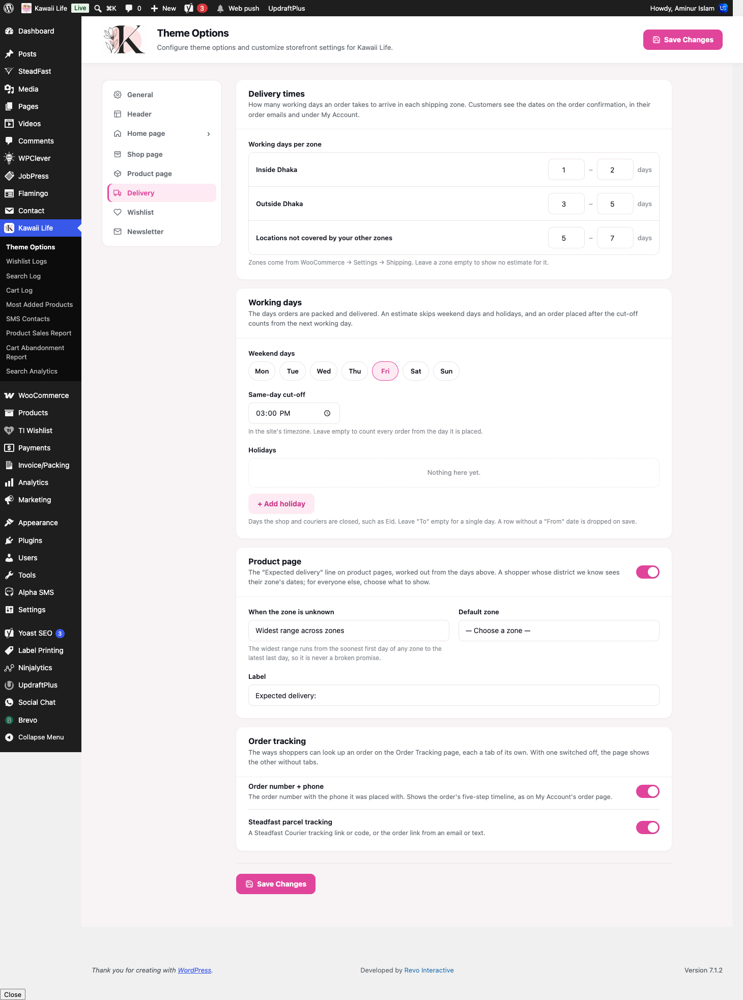
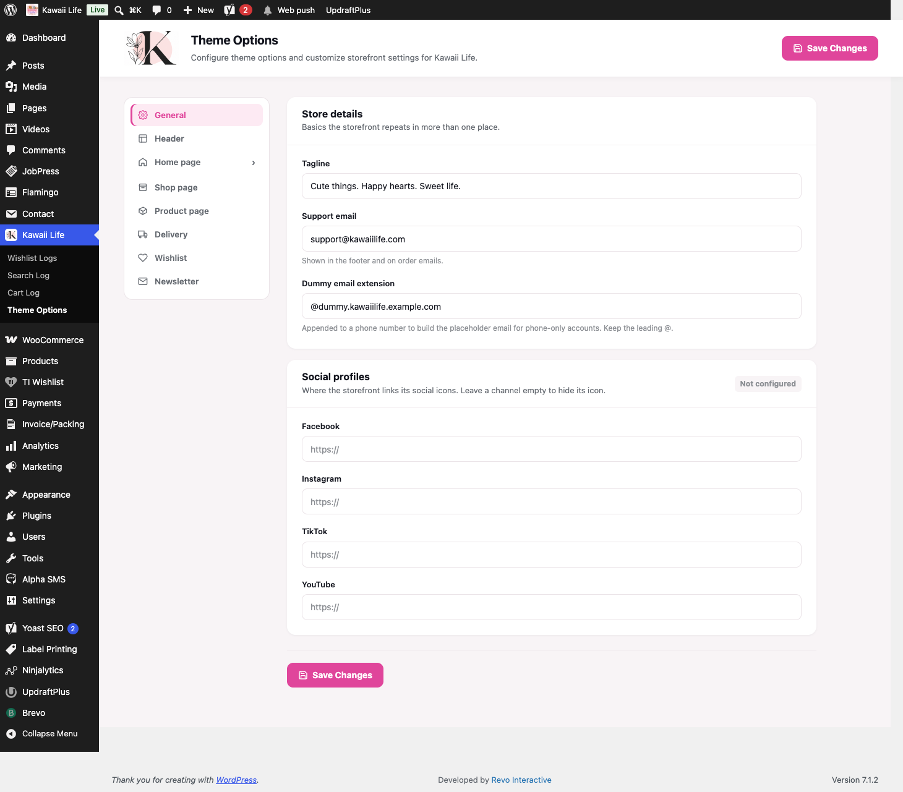

[Kawaii Life Site Owner's Guide](../README.md) › 2. Theme Options: the shop's main settings

# 2. Theme Options: the shop's main settings

**Where:** **Kawaii Life → Theme Options**

Theme Options holds the shop-wide settings that were built for Kawaii Life. The sections are listed on the left. Click one to open it, change what you need, then click the pink **Save Changes** button (top-right or at the bottom).

## 2.1 Header: announcement bar, logo and icons

**Announcement bar**: the pink strip at the very top of every page.

- **Show the bar**: the switch next to the title turns the whole strip on or off.
- **Slides**: each slide is one message, such as "Free Delivery on orders over ৳999".
  - **Icon**: choose *Emoji or text* and paste an emoji, choose a *Built-in icon*, or upload an *Image*.
  - **Text**: the message.
  - **Link** (optional): where the message goes when clicked, for example `/delivery-information/`.
  - Use the **↑ ↓** arrows to reorder slides and **×** to delete one. Click **+ Add slide** to add another.
- **Autoplay interval**: how long each message stays, in milliseconds (4000 = 4 seconds).
- **Pause while hovered**: stops the messages moving while a visitor's mouse is over them.

**Logo**

- **Header logo image**: click **Choose image** to pick a new logo from the Media Library. **Remove** goes back to the theme's logo.
- **Logo width**: the logo's width in pixels (68 by default).

**Navigation**: the menu links themselves are edited under **Appearance → Menus** (see [section 3](03-header-menu.md)). The **Open Menus** button takes you there.

**Header icons**: switch the search, account, wishlist and cart icons on the right of the header on or off.

## 2.2 Shop page

- **Page heading**: the **Title** ("All Products"), the **Title emoji** (🎀) and the **Short description** under it. The emoji also shows on category pages. Leave the description empty to hide it.
- **Catalog → Products per page**: how many products each page of the shop shows.
- **Price ranges**: the price choices in the shop's filter sidebar. Each range has a **Min price** and a **Max price**. Leave Min empty for "Under …" or Max empty for "Over …"; the labels are written for you.
- **Product cards**: show or hide the **Sale badge**, the **Star rating** and a **Quick add to cart** button on each product card.

## 2.3 Product page

The **Shipping** and **Returns** text here appears under the Shipping and Returns tabs on **every** product page. Leave a box empty to hide that tab.

💡 One product can have its own text instead. See [Product page tab](07-products.md#73-the-product-page-tab-taglines-video-shipping-and-returns-text).

## 2.4 Delivery

This section works out the **estimated delivery dates** customers see on product pages, on the order confirmation, in their emails and under My Account.

- **Working days per zone**: for each delivery zone, type the fewest and most working days an order takes (for example Inside Dhaka 1 – 2, Outside Dhaka 3 – 5). The zones themselves come from **WooCommerce → Settings → Shipping** (see [section 12](12-delivery-and-shipping.md)).
- **Weekend days**: click the days you don't deliver (Friday is selected).
- **Same-day cut-off**: orders placed after this time count from the next working day.
- **Holidays**: click **+ Add holiday** for Eid and other closures. Give it a name and a **From** date; add a **To** date if it's longer than one day. Holiday days are skipped when the dates are worked out.
- **Product page**: shows or hides the "Expected delivery" line on product pages. **When the zone is unknown** decides what a visitor who hasn't given an address sees. **Label** is the text in front of the dates.

💡 Once an order is placed, its delivery dates are saved with it. Changing these settings later doesn't change dates you've already promised.

## 2.5 General

- **Support email**: the address the "Email us" buttons on the information pages use. If it's empty, those buttons are hidden.
- **Dummy email extension**: used for accounts made with a phone number only. Leave this as it is.

## 2.6 Sections that aren't connected yet

These sections are in Theme Options, but changing them doesn't change the site yet. Edit these things in the places listed instead:

| Section | Edit it here instead |
| --- | --- |
| **General → Tagline** | **Settings → General → Tagline** |
| **General → Social profiles** | The footer, in **Appearance → Editor** (see [section 4](04-footer-and-newsletter.md)) |
| **Home page → Hero** | The **Hero Slider** block on the Home page (see [section 6.2](06-home-page.md#62-the-hero-slider)) |
| **Home page → Friends** | **Products → Friends**, and the Friends block on the Home page |
| **Wishlist** | **TI Wishlist → General Settings** |
| **Newsletter** | **Brevo → Forms** (see [section 20](20-sms-email-newsletter.md)) |

---

← [1. Logging in and finding your way around](01-logging-in.md) · [Contents](../README.md) · [3. The header menu](03-header-menu.md) →
