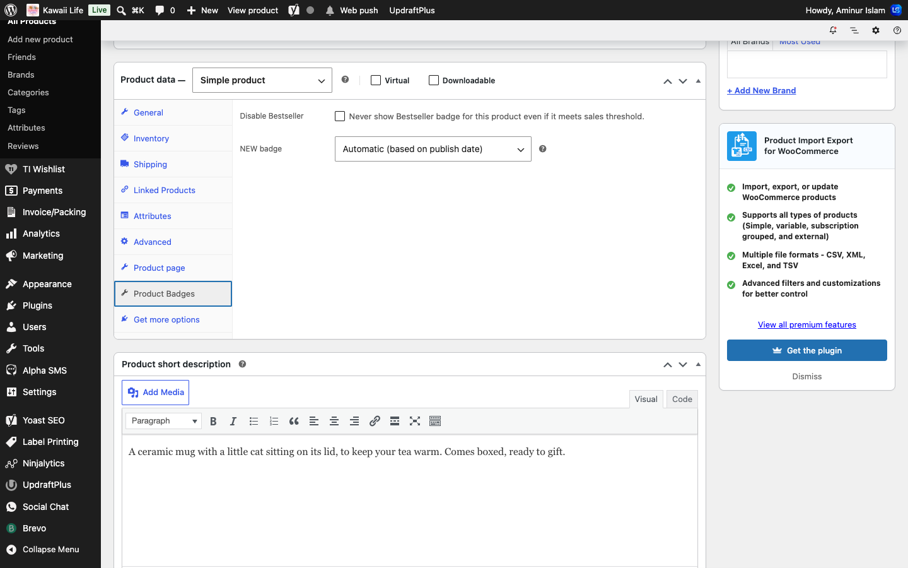
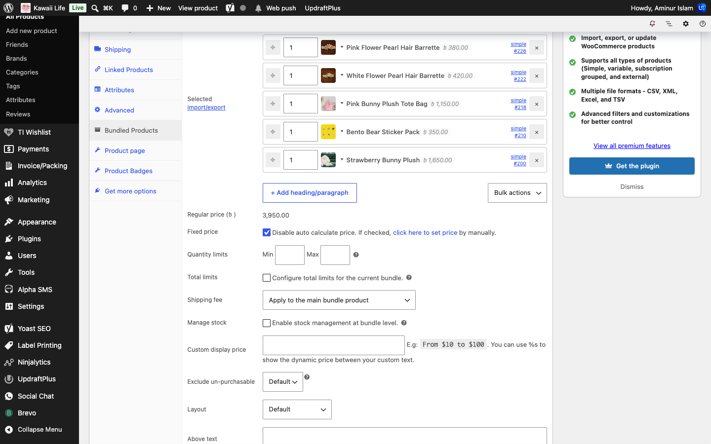
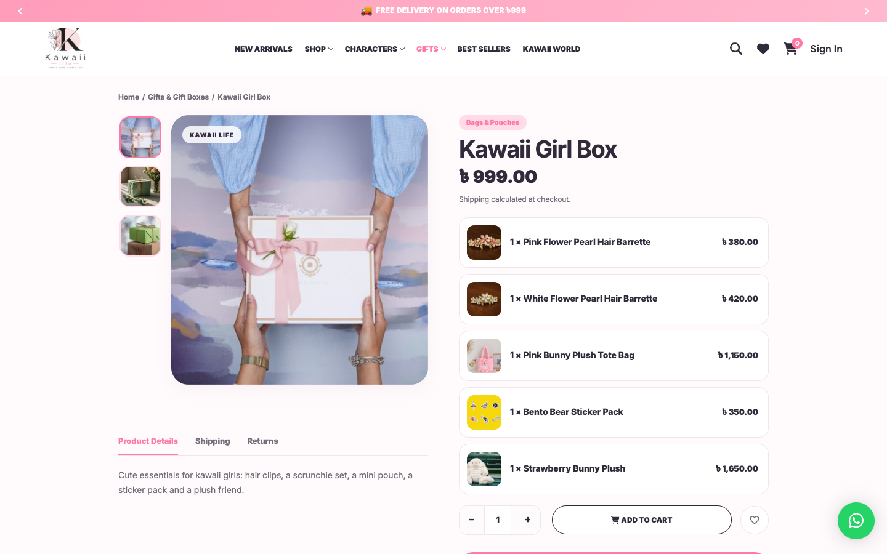

[Kawaii Life Site Owner's Guide](../README.md) › 7. Products

# 7. Products

**Where:** **Products → All Products**

## 7.1 Adding or editing a product

1. Click **Add new product**, or hover over a product and click **Edit**.
2. Type the **product name** at the top and the **description** in the big box under it.
3. Fill in the **Product data** box (below the description):
   - **General**: the **Regular price** and, for a sale, the **Sale price**.
   - **Inventory**: the **SKU** (needed for barcode labels) and stock.
   - **Shipping**: weight and size, if you use them.
   - **Linked Products**: see [7.5](#75-you-may-also-like-and-complete-your-set).
   - **Attributes** and **Variations**: for sizes or colours (see [7.4](#74-products-with-colours-sizes-or-styles)).
   - **Product page**: Kawaii Life's own tab (see [7.3](#73-the-product-page-tab-taglines-video-shipping-and-returns-text)).
   - **Product Badges**: the NEW and BESTSELLER badges for this product (see [7.7](#77-new-and-bestseller-badges)).
4. On the right:
   - **Product categories**: tick its category.
   - **Friends**: tick the character(s), if it's a character product.
   - **Product image**: the main photo. **Product gallery**: extra photos.
5. Click **Publish** (or **Update**).

💡 **Product images.** Every product image on the site is a square picture with a cute 3D emoji on a soft gradient. Use square images, at least 800 × 800 pixels, to keep the shop consistent.

## 7.2 What shoppers see

The product page brings together the gallery, price, the taglines, the colour or style choices, **Add to Cart** and **Buy It Now**, the expected delivery date, any **Offers for you**, the Description, Specification, Shipping, Returns and Reviews tabs, a video and **You May Also Like**.

## 7.3 The Product page tab (taglines, video, shipping and returns text)

- **Tagline**: short phrases shown under the product name, joined with a dot: "Ultra-Soft • Huggable Fit • Hypoallergenic". Click **Add phrase** for another one. Empty boxes are ignored.
- **Shipping tab** / **Returns tab**: text for this product only. Leave them empty to use the shop's text from **Theme Options → Product page**.
- **Video**: shown as "Watch it in action". Click **Choose from library** to use an uploaded video, or paste a YouTube, Vimeo or .mp4 link.
- **Video poster**: the picture shown before the video plays.

## 7.4 Products with colours, sizes or styles

A product that comes in several options is a **Variable product**:

1. In **Product data**, change the drop-down at the top from *Simple product* to **Variable product**.
2. In **Attributes**, add an attribute (for example *Color*), pick its values and tick **Used for variations**. Click **Save attributes**.
3. In **Variations**, click **Generate variations**, then open each variation to set its price, stock and picture.

💡 Shoppers pick options from round colour dots or small image tabs instead of plain drop-downs. To set this up, see [8.3 Attributes](08-categories-friends-attributes.md#83-attributes-colour-dots-and-image-swatches).

## 7.5 "You may also like" and "Complete your set"

- **Cross-sells**: products shown in the cart drawer's **You may also like** row and under **You will love these** on the cart page when this product is in the cart. Use this for "complete your set".
- **Upsells**: WooCommerce's own "you may also like" suggestions.

The cart drawer fills any free spots with matching products by itself. It never suggests something already in the cart or out of stock.

## 7.6 Reviews

**Where:** **Products → Reviews**

Customers can give a review a title and attach one photo or video. Reviews with a photo or video wait for you here:

- Hover over a review and click **Approve** to publish it, **Spam** or **Trash** to remove it.
- The **Photo / video** column shows what they attached. Check it before approving.

## 7.7 NEW and BESTSELLER badges

Product cards and the product page's main picture can carry a small **NEW** or **BESTSELLER** badge in the corner, next to the Sale badge. They're added by themselves:

- **NEW**: products published in the last 30 days.
- **BESTSELLER**: products whose total sales reach the threshold you set.

Both numbers, and switches to turn each badge off for the whole shop, are in **Kawaii Life → Theme Options → Shop page → Product cards** (see [2.2](02-theme-options.md#22-shop-page)).

**To change one product's badges**, edit the product and open the **Product Badges** tab in **Product data**:

- **NEW badge**: **Automatic (based on publish date)** is the usual choice. **Always show** keeps the badge on (for a product you want to keep promoting as new); **Never show (disable)** keeps it off.
- **Disable Bestseller**: tick it to never show the BESTSELLER badge on this product, however much it sells.

Click **Update** to save.

## 7.8 Gift boxes (bundles)

The **Study Box**, **Kawaii Girl Box** and **Premium Gift Box** are **bundles**: one product made of several others. The product page lists what's inside, each item with its picture, and the cart, cart drawer and checkout show the box with its items underneath.

**To make a new gift box:**

1. Click **Add new product** and type its name, description and pictures as for any product.
2. In **Product data**, change the drop-down at the top to **Smart bundle**.
3. In the **Bundled Products** tab, search for each product to put in the box and set how many of each.
4. **Price**: by itself, the box costs the items' prices added up (less any **Discount** you set in the same tab). To charge your own price instead, as the three gift boxes do, tick **Disable auto calculate price.** and type the price in **General**.
5. Click **Publish**.

On the site, the box's page lists everything inside it:

The shop-wide bundle options (where the item list sits on the product page, how the price is shown) are under **WPClever → Product Bundles**.

💡 Unless you tick **Enable stock management at bundle level.**, a box is in stock only while every item in it is.

---

← [6. The home page](06-home-page.md) · [Contents](../README.md) · [8. Categories, Friends and attributes](08-categories-friends-attributes.md) →
