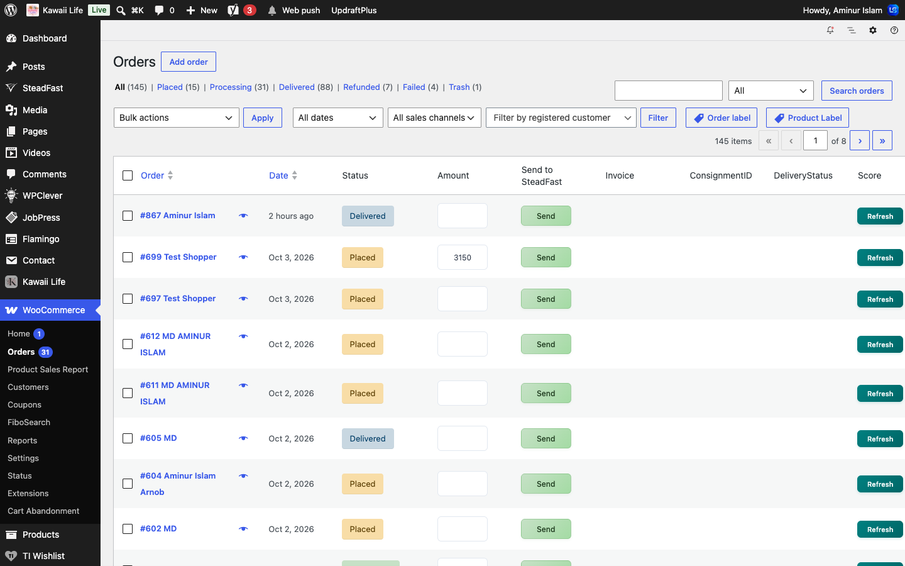
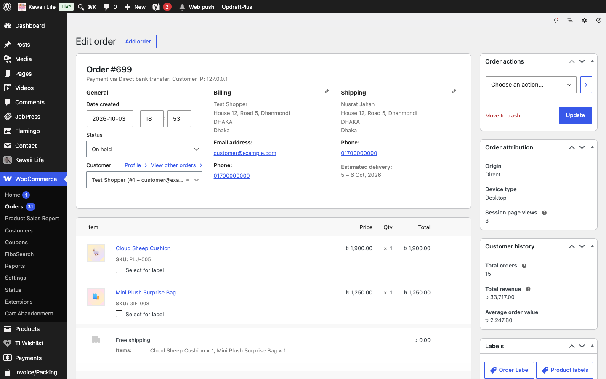

[Kawaii Life Site Owner's Guide](../README.md) › 10. Orders

# 10. Orders

**Where:** **WooCommerce → Orders**

- **New orders** appear at the top. The number next to **Orders** in the menu is how many are waiting.
- Use the status links above the list (**Placed**, **Confirmed**, **Processing**, **Shipped** …) to filter.
- 💡 **Pending payment** lists orders that were started but not paid: your incomplete orders.
- Search by order number, customer name, phone or email with the box at the top-right. A barcode scanner works here too: scan an invoice or order label to find the order.

## 10.1 Handling an order

Click an order to open it.

- **Status**: change it as the order moves along, then click **Update** (see [10.2](#102-the-order-flow) for the whole flow).
- **Shipping** shows the delivery address and phone, and the **Estimated delivery** dates the customer was promised.
- **Billing** is filled in from the delivery address automatically. Customers only ever see their delivery address.
- **To change items**, set the order's status to **Placed** or **Pending payment** first. Then use **Add item(s)**, change quantities, or click **×** on an item, and click **Recalculate**.
- **Order notes** (right): add a **Private note** for your team, or a **Note to customer**, which emails them.
- **Order actions** (top-right): resend the order emails to the customer.

💡 To move many orders at once, tick them in the list, choose **Change status to …** from **Bulk actions** and click **Apply**.

## 10.2 The order flow

Every order moves through the same steps:

**Placed → Confirmed → Processing → Shipped → Delivered**

| Status | What it means | How it gets there |
| --- | --- | --- |
| **Pending payment** | Started, not paid | By itself, when an online payment isn't finished |
| **Placed** | A new order waiting for you | By itself: every Cash on Delivery and bank transfer order starts here |
| **Confirmed** | You've called the customer (COD) or seen the money (bank transfer) | You set it. An order paid online starts here |
| **Processing** | Being packed | You set it |
| **Shipped** | With the courier | By itself when you send the order to Steadfast ([10.3](#103-sending-orders-to-steadfast)), or you set it |
| **Delivered** | The customer has it | By itself from Steadfast, or you set it |
| **Returned** | The parcel came back: refused, unreachable or sent back | By itself from Steadfast, or you set it. The items go back into stock and the order is left out of the sales reports |
| **Cancelled**, **Refunded**, **Failed** | As WooCommerce has always had them | |

The customer is emailed at each step ([20.2](20-sms-email-newsletter.md#202-order-emails)), and can follow the order on a five-step tracker in **My Account** and on the **Order Tracking** page, each step with the date and time it was reached.

💡 *Placed* and *Delivered* are WooCommerce's *On hold* and *Completed* under the shop's own names, so plugins and reports that mention On hold or Completed mean these.

## 10.3 Sending orders to Steadfast

**Where:** **WooCommerce → Orders**, and **SteadFast** in the menu for the account settings

In the orders list, the **Send to SteadFast** column has a **Send** button on each order. The **Amount** box beside it is the cash the courier collects: leave it empty to collect the order total, or type `0` for an order that's already paid. To send many at once, tick the packed orders, choose **Send to SteadFast** from **Bulk actions** and click **Apply**.

Each order gets a Steadfast consignment and its **tracking code**, and moves to **Shipped** by itself. The Shipped email gives the customer the tracking code and a **Track your order** button.

When Steadfast reports the parcel delivered, the order moves to **Delivered**; if it comes back, to **Returned**. This happens through Steadfast's webhook, or when you click **Check** in the order's **DeliveryStatus** column. A part delivery (the customer kept some items) is marked Delivered, with an order note reminding you to refund the items that come back.

💡 Orders only ever move forward by themselves, and an order that's Cancelled, Refunded, Failed or Returned is never reopened.

⚠️ The webhook needs the **Webhook Callback URL** and **Webhook Secret Token** from **SteadFast** pasted into the API Webhook section of your Steadfast merchant dashboard. Without them, statuses only update when you click **Check**.

---

← [9. Coupons and "Offers for you"](09-coupons-and-offers.md) · [Contents](../README.md) · [11. Invoices, packing slips and labels](11-invoices-and-labels.md) →
