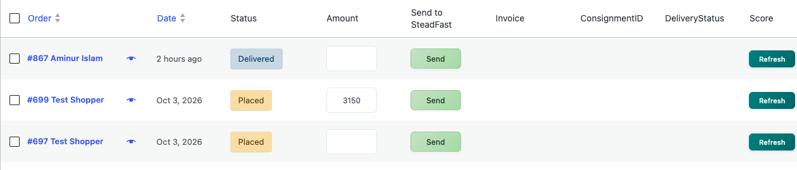

[Kawaii Life Site Owner's Guide](../README.md) › 10. Orders

# 10. Orders

**Where:** **WooCommerce → Orders**

- **New orders** appear at the top. The number next to **Orders** in the menu is how many are waiting.
- Use the status links above the list (**Placed**, **Confirmed**, **Processing**, **Shipped** …) to filter.
- 💡 **Pending payment** lists orders that were started but not paid: your incomplete orders.
- Search by order number, customer name, phone or email with the box at the top-right. A barcode scanner works here too: scan an invoice or order label to find the order.

## 10.1 Handling an order

Click an order to open it.

- **Status**: change it as the order moves along, then click **Update** (see [10.2](#102-order-statuses)).
- **Shipping** shows the delivery address and phone, and the **Estimated delivery** dates the customer was promised.
- **Billing** is filled in from the delivery address automatically. Customers only ever see their delivery address.
- **To change items**, set the order's status to **Placed** or **Pending payment** first. Then use **Add item(s)**, change quantities, or click **×** on an item, and click **Recalculate**.
- **Order notes** (right): add a **Private note** for your team, or a **Note to customer**, which emails them.
- **Order actions** (top-right): resend the order emails to the customer.

💡 To move many orders at once, tick them in the list, choose **Change status to …** from **Bulk actions** and click **Apply**.

## 10.2 Order statuses

Every order moves through the same steps:

**Placed → Confirmed → Processing → Shipped → Delivered**

| Status | What it means | What you do |
| --- | --- | --- |
| **Placed** | A new order | Call the customer (COD) or check the payment arrived (bank transfer), then set it to **Confirmed** |
| **Confirmed** | The order is real | Set it to **Processing** when you start packing |
| **Processing** | Being packed | Send it to Steadfast ([10.3](#103-sending-orders-to-steadfast)) |
| **Shipped** | With the courier | Nothing: it moves on by itself |
| **Delivered** | The customer has it | Nothing |
| **Returned** | The parcel came back | Nothing: the items go back into stock |

The customer gets an email at each step and can follow the order in **My Account** and on the **Order Tracking** page.

## 10.3 Sending orders to Steadfast

1. Go to **WooCommerce → Orders**.
2. Find the packed order. In the **Amount** box, leave it empty to collect the order total, or type `0` if it's already paid.
3. Click **Send** in the **Send to SteadFast** column.

The order moves to **Shipped**, and the customer gets an email with the tracking code. When Steadfast delivers it, or it comes back, the order moves to **Delivered** or **Returned** by itself.

💡 To send several orders at once, tick them, choose **Send to SteadFast** from **Bulk actions** and click **Apply**.

💡 Order still on Shipped after delivery? Click **Check** in its **DeliveryStatus** column.

---

← [9. Coupons and "Offers for you"](09-coupons-and-offers.md) · [Contents](../README.md) · [11. Invoices, packing slips and labels](11-invoices-and-labels.md) →
