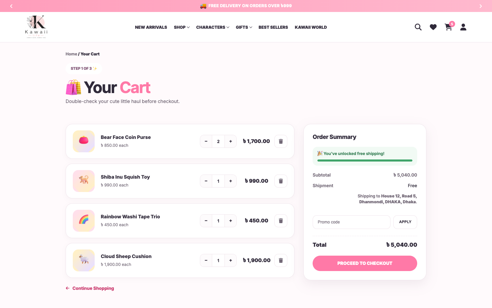
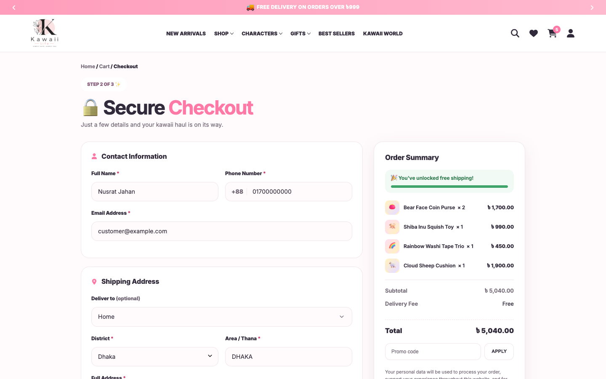
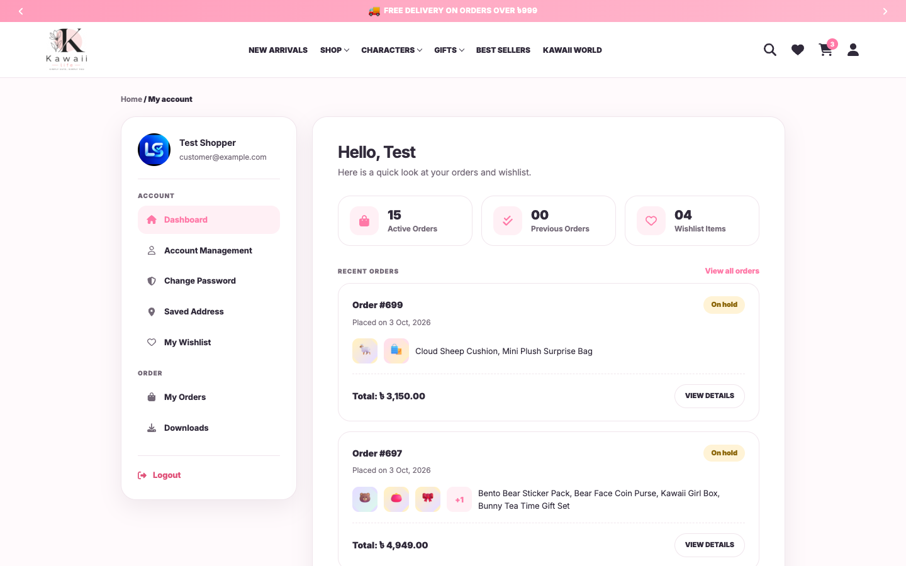
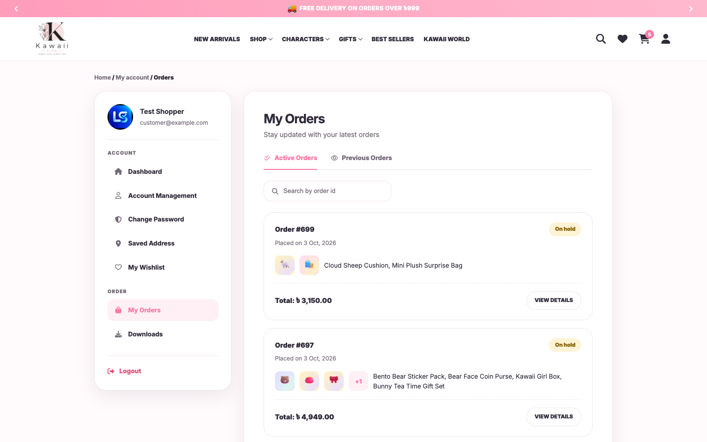
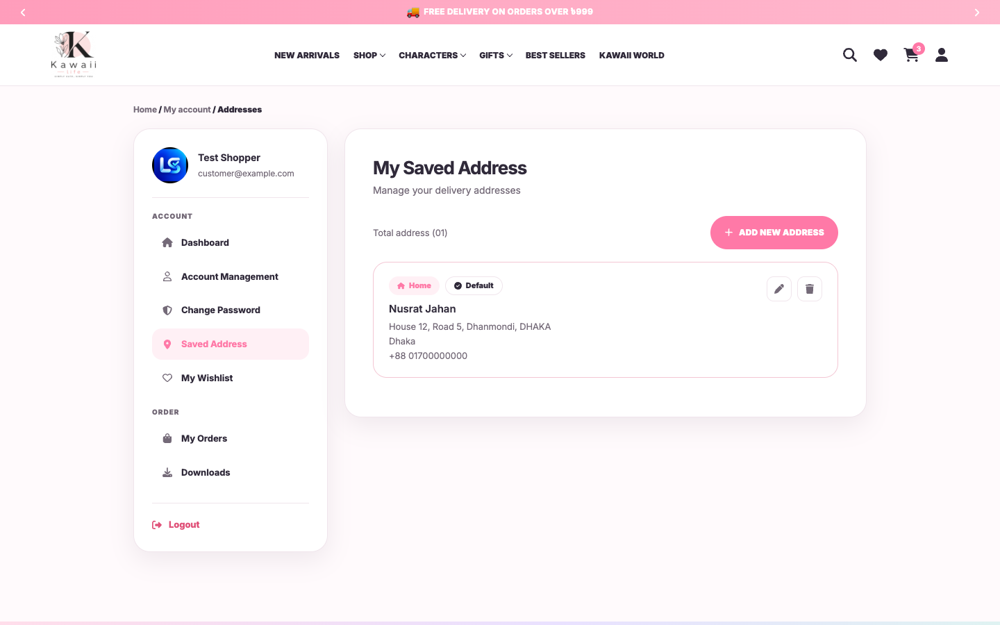
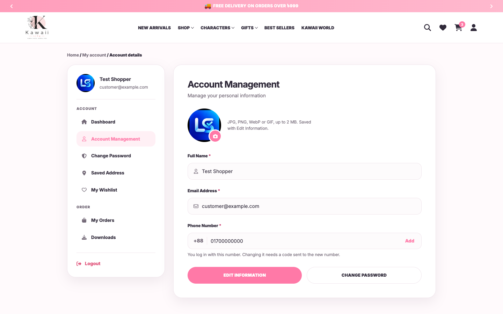
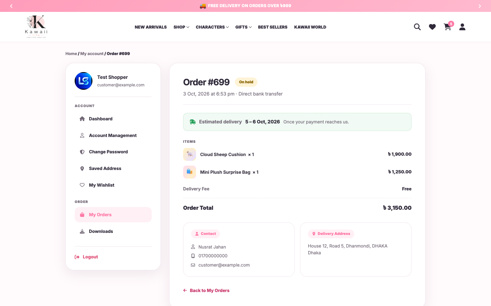
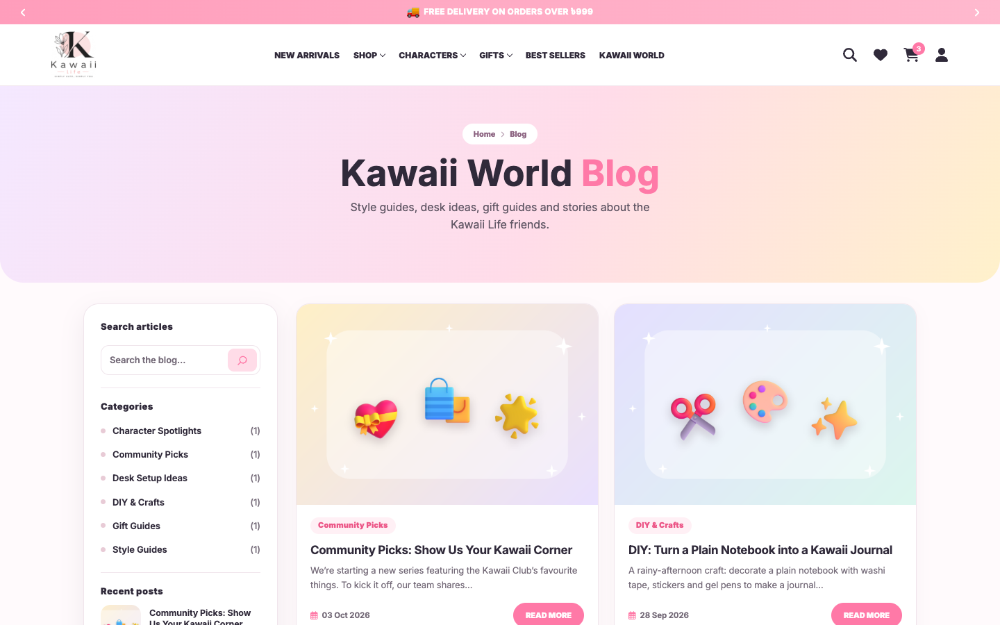
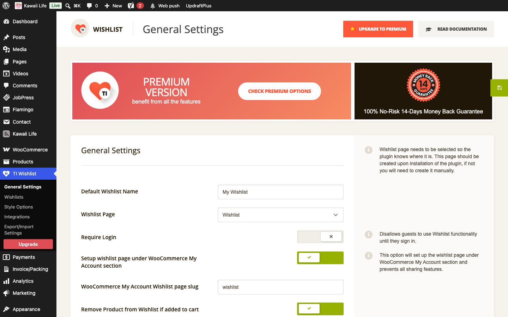
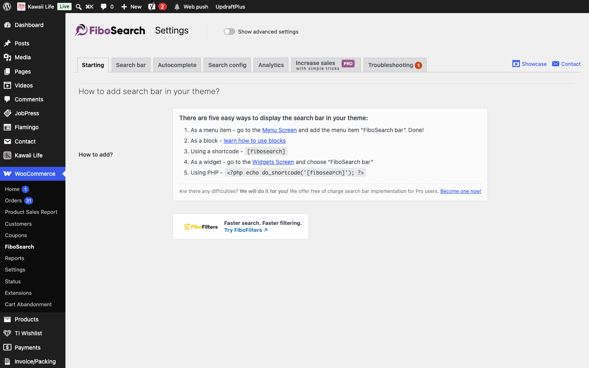

[Kawaii Life Site Owner's Guide](../README.md) › 14. What customers see: cart, checkout and My Account

# 14. What customers see: cart, checkout and My Account

You don't need to set these up; they're shown here so you know what customers see.

**Cart**: with the free-delivery progress bar and "You will love these" suggestions.

**Checkout**: Contact Information, one Shipping Address (they can pick a saved one under **Deliver to**), payment, and the Order Summary.

**My Account**: a greeting, order and wishlist counts and the latest orders. The menu on the left has My Orders, Downloads, Saved Address, My Wishlist, Account Management (name, phone, photo) and Change Password.

**One order**: status, estimated delivery, a tracker of the order's steps, items, delivery address and invoice.

**Wishlist**: saved products with Add to Cart.

The wishlist's own options (who can use it, sharing, button text) are under **TI Wishlist → General Settings**.

**Search**: the search box in the header and the shop sidebar suggests products with their prices as the shopper types. Its options are under **WooCommerce → FiboSearch**.

---

← [13. Customers, sign-up and saved addresses](13-customers-and-accounts.md) · [Contents](../README.md) · [15. Wishlists, searches and carts (activity logs)](15-activity-logs.md) →
