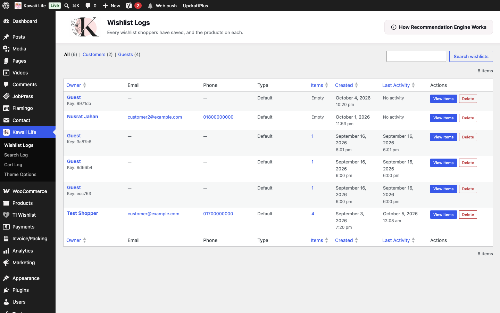
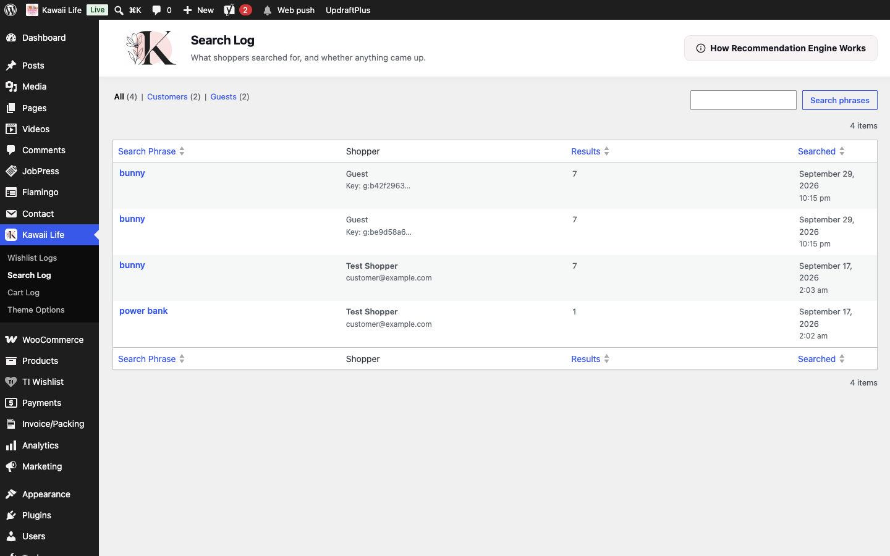
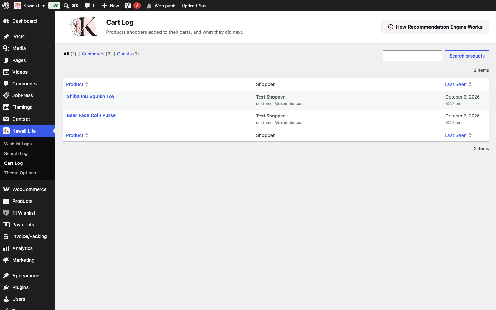
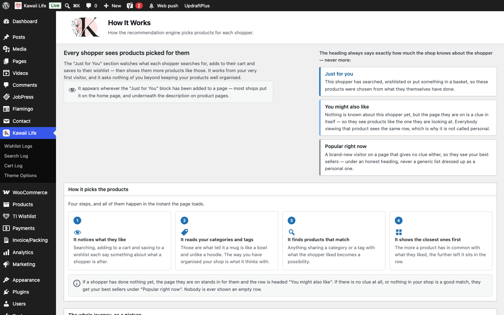

[Kawaii Life Site Owner's Guide](../README.md) › 15. Wishlists, searches and carts (activity logs)

# 15. Wishlists, searches and carts (activity logs)

**Where:** **Kawaii Life → Wishlist Logs / Search Log / Cart Log**

These pages show what shoppers are interested in. Use them to plan stock and promotions.

**Wishlist Logs**: every wishlist and the products on it. Click a wishlist to see its items. **Customers** and **Guests** filter the list.

**Search Log**: what shoppers searched for and whether anything came up. Searches with no results tell you what people want that you don't sell yet.

**Cart Log**: products added to carts, by whom and when.

## 15.1 How "Just for You" recommendations work

Click **How Recommendation Engine Works** at the top of any log page for a full explanation. In short: the shop watches what each shopper searches for, adds to their cart and saves to their wishlist, and shows them similar products, matched by **category and tags**.

💡 The better your categories and tags, the better the suggestions. Give every product a category and a few tags (for example *bunny*, *pastel*, *plush*).

To show the recommendations on a page, add the **Just for You** block.

---

← [14. What customers see: cart, checkout and My Account](14-customer-experience.md) · [Contents](../README.md) · [16. Videos and the Kawaii World page](16-videos-and-kawaii-world.md) →
