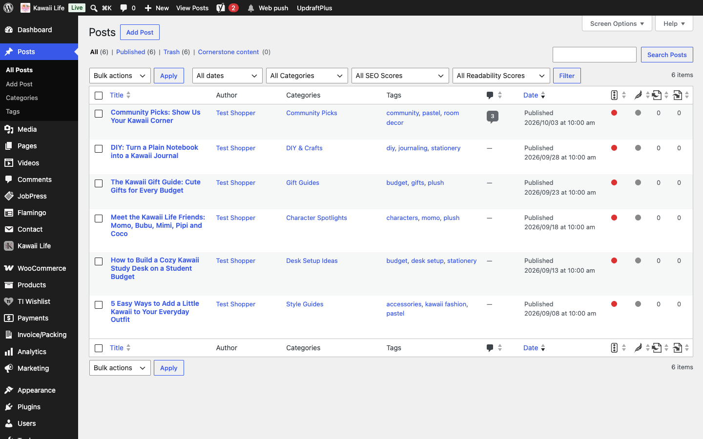
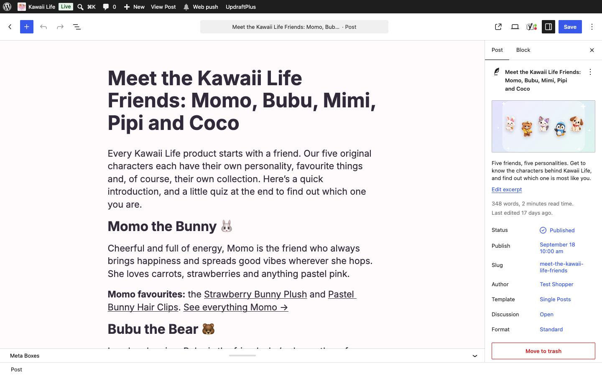
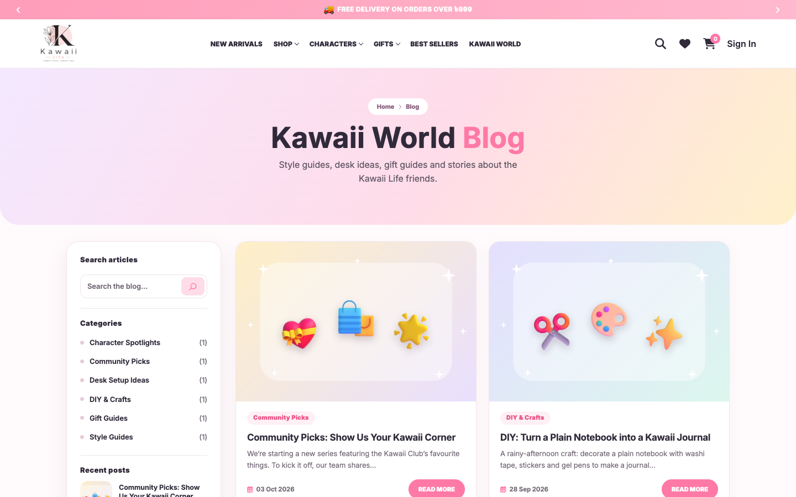
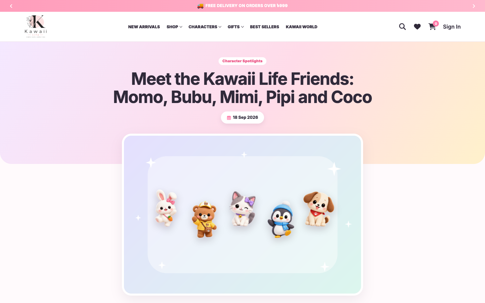

[Kawaii Life Site Owner's Guide](../README.md) › 17. The blog

# 17. The blog

**Where:** **Posts**

The **Blog** page (`/blog/`) lists your articles with a sidebar of search, categories, recent posts and tags.

**To write an article:**

1. Click **Posts → Add Post**.
2. Type the title and the article.
3. On the right, under **Post**, choose a **Category**, add **Tags**, and set a **Featured image** (the cover picture on the blog cards and at the top of the article).
4. Click **Publish**.

💡 Each article page ends with "More to read" (three related articles) and comments. Approve or delete comments under **Comments**.

⚠️ The articles' author shows as "Test Shopper". Change your display name under **Users → Profile → Display name publicly as**, or choose another author on each post (**Post → Author**).

---

← [16. Videos and the Kawaii World page](16-videos-and-kawaii-world.md) · [Contents](../README.md) · [18. Information pages](18-information-pages.md) →
