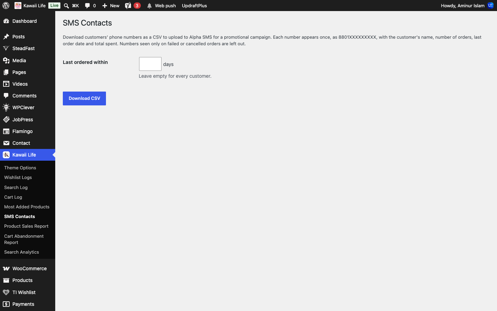
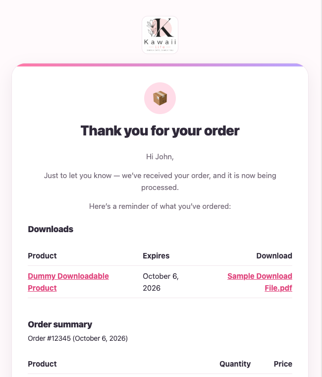

[Kawaii Life Site Owner's Guide](../README.md) › 20. SMS, email and newsletter

# 20. SMS, email and newsletter

## 20.1 SMS (Alpha SMS)

**Where:** **Alpha SMS → Settings**

Alpha SMS sends the login and sign-up codes, and can text customers when their order changes status.

- **Balance** shows how much SMS credit is left.
- **Notify Customer**: switch on the order statuses you want a text for (for example *Confirmed*, *Shipped* and *Delivered*), then click **Save all changes**.
- **Notify Admin on New Order** texts you when an order comes in.
- **Alpha SMS → Campaign** sends one message to many customers at once.
- Shoppers who leave items in their cart get a text with a link back to it. Switch this off in **Theme Options → General** ([2.5](02-theme-options.md#25-general)).

**To send a promotional SMS to your customers:**

1. Go to **Kawaii Life → SMS Contacts**.
2. To text only recent customers, type a number of days in **Last ordered within**. Leave it empty for everyone.
3. Click **Download CSV**.
4. Upload the file in your Alpha SMS panel and send the campaign from there.

⚠️ If the balance runs out, customers can't log in or sign up. Top it up on your Alpha SMS account. The record of sent messages is on the Alpha SMS website.

⚠️ Leave the **API Key** as it is; it connects the site to your Alpha SMS account.

## 20.2 Order emails

**Where:** **WooCommerce → Settings → Emails**

Customers get an email when their order is **placed**, **confirmed**, **shipped** (with the tracking code), **delivered** and **returned**. Every email has the Kawaii Life look.

**To change an email:**

1. Go to **WooCommerce → Settings → Emails**.
2. Click **Manage** next to the email.
3. Untick **Enable this email notification** to stop it, or change its **Subject** and **Email heading**.
4. Click **Save changes**.

The **Email sender options** at the bottom set the "From" name and address. To see what an email looks like, scroll to **Email preview** and pick the email.

## 20.3 Newsletter (Brevo)

**Where:** **Brevo → Forms**

The **Join the Kawaii Club** form in the footer is the Brevo form **Default Form**. Edit it here to change its fields, button and messages. New subscribers go to your Brevo contact list, where you send newsletters from your Brevo account.

---

← [19. Forms and messages](19-forms-and-messages.md) · [Contents](../README.md) · [21. SEO (Google and social sharing)](21-seo.md) →
