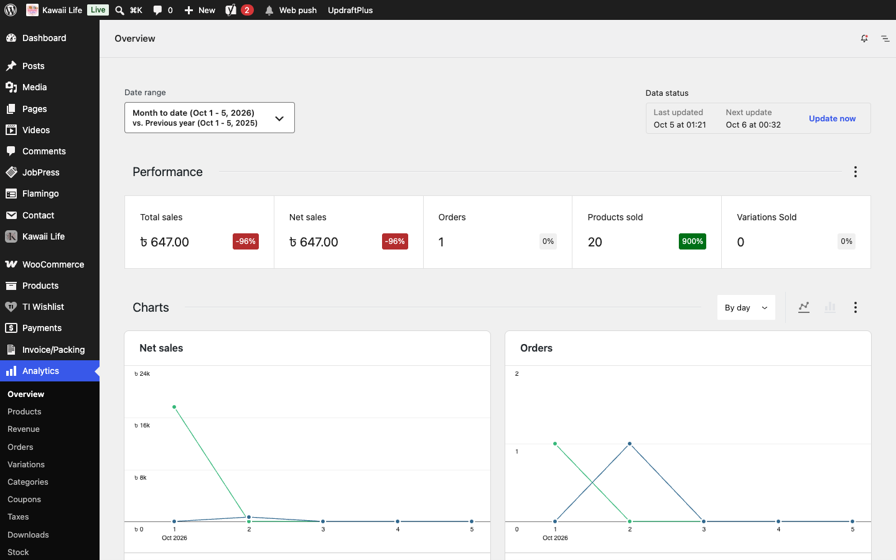
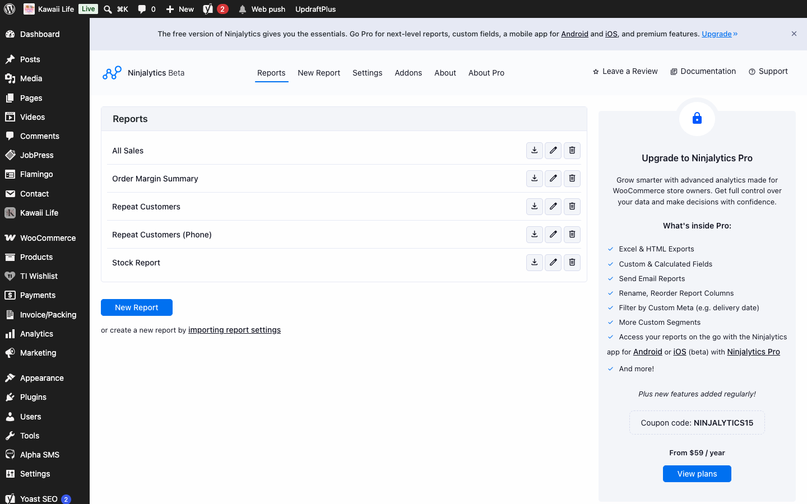
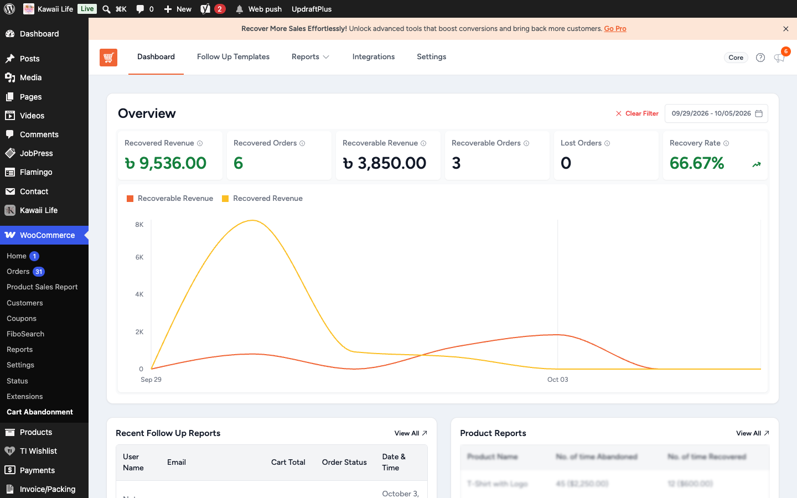

[Kawaii Life Site Owner's Guide](../README.md) › 22. Reports

# 22. Reports

- **Analytics → Overview**: sales, orders and the best-selling products for any date range. **Analytics → Stock** shows low and out-of-stock products.

- **Ninjalytics** (**WooCommerce → Product Sales Report**): sales by product, and order exports to a spreadsheet.

- **WooCommerce → Cart Abandonment**: carts that were started but not checked out, and the recovery emails sent for them.

- **Kawaii Life → Search Log / Cart Log / Wishlist Logs / Most Added Products**: see [section 15](15-activity-logs.md).

💡 You'll also find **Product Sales Report**, **Cart Abandonment Report** and **Search Analytics** in the **Kawaii Life** menu, so all reports are in one place. The Cart Abandonment Report shows each shopper's phone, so you can call them.

---

← [21. SEO (Google and social sharing)](21-seo.md) · [Contents](../README.md) · [23. Backups](23-backups.md) →
