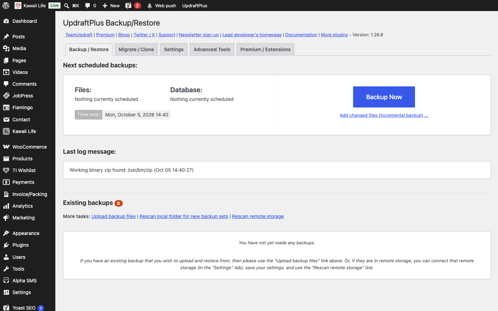

[Kawaii Life Site Owner's Guide](../README.md) › 23. Backups

# 23. Backups

**Where:** **Settings → UpdraftPlus Backups** (or **UpdraftPlus** in the menu)

- Click **Backup Now** before any big change, such as updating plugins.
- Under **Settings**, set automatic backups (for example daily database, weekly files) and connect remote storage such as Google Drive, so a copy is kept off the server.
- **Restore** brings the whole site back to a saved backup.

---

← [22. Reports](22-reports.md) · [Contents](../README.md) · [24. Not live yet](24-not-live-yet.md) →
