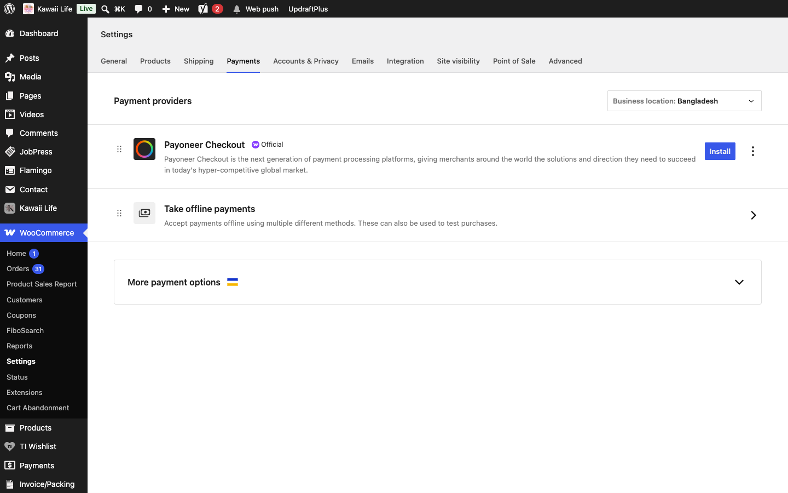

[Kawaii Life Site Owner's Guide](../README.md) › 24. Not live yet

# 24. Not live yet

These parts of the agreed project are still being finished. Until they're done, the site behaves as described here:

| Feature | Today |
| --- | --- |
| **bKash, Nagad and SSLCommerz payments** | Only Cash on Delivery and Bank Transfer are on (**WooCommerce → Settings → Payments**). |
| **Steadfast and Pathao courier** | Not connected. Book deliveries with the courier directly. |
| **Confirmed, Shipped, Delivered and Returned order statuses** | Use WooCommerce's statuses (section 10.1). The Order Tracking timeline completes when an order is **Completed**. |
| **COD verification, payment, abandoned-cart and promotional SMS** | Not built yet. Order SMS and login codes work. |
| **NEW and BESTSELLER badges** | Product cards show only the Sale badge. |
| **Gift box bundles** | Gift boxes are sold as ordinary products. |
| **"Just for You" on the home page** | The block exists; it will be added to the home page. |
| **Footer social links and WhatsApp chat button** | Social links point nowhere until you add your profiles (section 4). The WhatsApp button needs the shop's number. |
| **Google and Facebook login buttons** | They're shown on the login card but don't work yet. |
| **Order email branding** | Emails use WooCommerce's default look. |
| **Blocking fraudulent customers** | Not available yet. |
| **Payment Methods page** | Empty; needs your content. |

---

← [23. Backups](23-backups.md) · [Contents](../README.md) · [25. Quick answers](25-quick-answers.md) →
